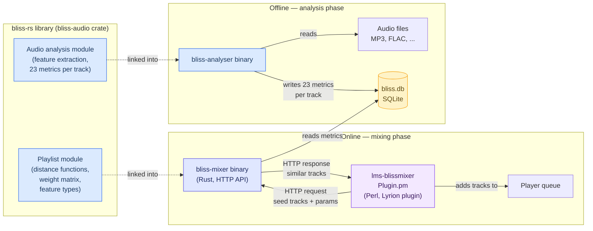
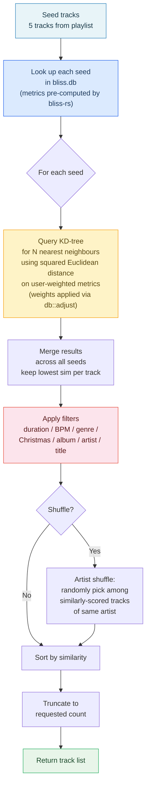
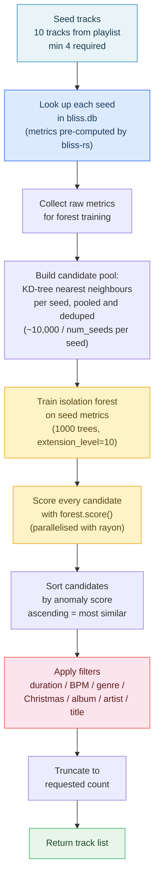
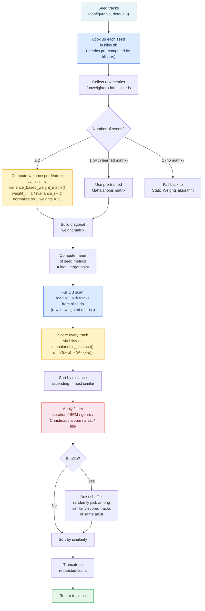

# Mixing Algorithms

BlissMixer supports three algorithms for selecting tracks similar to the current
seed tracks. Each uses the same 23 audio features extracted by
[bliss](https://lelele.io/bliss.html) (1× Tempo, 7× Timbre, 2× Loudness,
13× Chroma) but differs in how similarity is measured and candidates are found.

## Architecture

Three components work together. The first two are separate binaries from the
[bliss-rs](https://github.com/Polochon-street/bliss-rs) ecosystem, the third
is the Lyrion / LMS plugin that orchestrates everything.



### Where bliss-rs is used

| Component | Uses bliss-rs? | How |
|---|---|---|
| **bliss-analyser** | Yes — core dependency | Calls `bliss-rs` to decode each audio file and compute the 23 features (Tempo, Zcr, Spectral Centroid, etc.). Stores results in `bliss.db`. |
| **bliss-mixer** | Yes — types and functions | Uses `NUMBER_FEATURES` (dimension count), `AnalysisIndex` (feature names), `variance_based_weight_matrix()` and `mahalanobis_distance()` from the `playlist` module. Does **not** use audio analysis — reads pre-computed features from the SQLite database. |
| **lms-blissmixer** | No | Pure Perl. Sends seed track paths to bliss-mixer via HTTP, receives similar track paths back. Handles LMS integration, settings UI, and debug logging. |

**Why a bliss-rs fork?** The upstream
[bliss-audio](https://crates.io/crates/bliss-audio) crate on crates.io bundles
`aubio-rs` and `rustfft` as mandatory dependencies (needed for audio analysis).
The [fork](https://github.com/chrober/bliss-rs/tree/feature/analysis-gate-and-variance-weights)
puts these behind an `analysis` feature gate, so bliss-mixer can depend on the
crate without pulling in heavy native audio libraries it never uses.

## Comparison

<table>
<tr>
  <th></th>
  <th>Static Weights</th>
  <th>Extended Isolation Forest</th>
  <th>Dynamic Weights</th>
</tr>
<tr><th colspan="4" style="background-color:#555; text-align:center; border-width:1px 0px; border-style:solid;">At a glance</th></tr>
<tr>
  <td><b>How it works</b></td>
  <td>You set four sliders to tell the mixer what matters most to you (rhythm, tone, loudness, harmony). It finds songs that are similar according to your preferences.</td>
  <td>The mixer looks at a batch of recent songs, learns what they have in common, and finds songs that fit the same pattern. You don't configure anything.</td>
  <td>The mixer looks at what your last few songs share — if they have a similar rhythm but different harmonies, it focuses on rhythm. It figures out what matters <em>for these songs</em> automatically.</td>
</tr>
<tr>
  <td><b>User control</b></td>
  <td>Full — you decide what "similar" means via sliders</td>
  <td>None — the algorithm decides everything</td>
  <td>None — but it adapts to each set of seeds, so it indirectly follows your listening choices</td>
</tr>
<tr>
  <td><b>Best for</b></td>
  <td>When you know what you want: "give me songs that match <em>this</em> mood, and I care most about harmony"</td>
  <td>When you want the mixer to figure things out from a larger sample of recent songs</td>
  <td>When you want an adaptive mix that evolves with what you're listening to, hands-free</td>
</tr>
<tr>
  <td><b>Number of recent songs used</b></td>
  <td>5</td>
  <td>10 (at least 4 needed)</td>
  <td>Configurable (default 3, as few as 2)</td>
</tr>
<tr>
  <td><b>Downsides</b></td>
  <td>You need to find the right slider positions yourself; wrong settings can give poor results</td>
  <td>Needs many seed songs; treats all audio characteristics as equally important — can't be nudged</td>
  <td>With very diverse seeds, it can't find a clear common thread and the weighting becomes bland</td>
</tr>
<tr><th colspan="4" style="background-color:#555; text-align:center; border-width:1px 0px; border-style:solid;">Technical details</th></tr>
<tr>
  <td><b>Seed tracks</b></td>
  <td>5</td>
  <td>10 (min 4 required)</td>
  <td>Configurable (default 3, min 2)</td>
</tr>
<tr>
  <td><b>Seed selection</b></td>
  <td>Random from last 10 in queue</td>
  <td>Random from last 20 in queue</td>
  <td>Last N from queue (strict order) or random (configurable)</td>
</tr>
<tr>
  <td><b>Candidate search</b></td>
  <td>KD-tree nearest-neighbour per seed</td>
  <td>KD-tree per seed, then pooled</td>
  <td>Full database scan</td>
</tr>
<tr>
  <td><b>Distance metric</b></td>
  <td>Squared Euclidean (user-weighted)</td>
  <td>Anomaly score (forest model)</td>
  <td>Mahalanobis (variance-weighted), via <code>bliss-rs</code></td>
</tr>
<tr>
  <td><b>Feature weighting</b></td>
  <td>Manual sliders (Tempo/Timbre/Loudness/Chroma)</td>
  <td>None (all features equal)</td>
  <td>Automatic from seed variance, via <code>bliss-rs</code> <code>variance_based_weight_matrix()</code></td>
</tr>
<tr>
  <td><b>Multi-seed merging</b></td>
  <td>Per-seed results merged, best sim wins</td>
  <td>All candidates scored jointly</td>
  <td>Single mean point, all scored jointly</td>
</tr>
<tr>
  <td><b>Artist shuffle</b></td>
  <td>Yes</td>
  <td>No</td>
  <td>Yes</td>
</tr>
<tr>
  <td><b>bliss-rs usage</b></td>
  <td>Feature count (<code>NUMBER_FEATURES</code>)</td>
  <td>Feature count (<code>NUMBER_FEATURES</code>)</td>
  <td><code>NUMBER_FEATURES</code>, <code>AnalysisIndex</code>, <code>variance_based_weight_matrix()</code>, <code>mahalanobis_distance()</code></td>
</tr>
<tr>
  <td><b>Fallback</b></td>
  <td>— (this is the default)</td>
  <td>Falls back to Static if &lt; 4 seeds</td>
  <td>Falls back to Static if &lt; 2 seeds or no matrix</td>
</tr>
</table>

## Static Weights (default)

The original algorithm by CDrummond. Each seed independently queries a KD-tree
for nearest neighbours. Results are merged, filtered, and sorted.

> **In plain English:** You tell the mixer what matters to you by adjusting four
> sliders: Tempo (how fast/slow), Timbre (the "colour" or texture of the sound),
> Loudness, and Chroma (harmony and key). The mixer then searches for songs that
> sound similar to what you've been listening to, focusing more on the aspects
> you've emphasised. Think of it like telling a record store clerk: "Find me
> something that *feels* like this, and I care most about the groove and the
> harmonies, less about loudness." — You stay in control of what "similar" means.

**Weight control:** The user sets four sliders (1–100) for Tempo, Timbre,
Loudness, and Chroma. These are normalized and expanded into 23 per-feature
multipliers that are applied when metrics are loaded from the database. The
KD-tree and distance calculations then use these pre-weighted values.



### Key characteristics

- **Per-seed search:** Each seed independently finds its closest neighbours in
  the KD-tree. A track that is close to multiple seeds gets the *lowest*
  (best) similarity score.
- **User-controlled weighting:** Feature weights are baked into the stored
  metrics at load time via `db::adjust()`. Changing the sliders requires
  restarting the mixer process.
- **Candidate pool:** Governed by `count × seeds × 50` (min 10,000). Only this
  many KD-tree results are evaluated per seed.

---

## Extended Isolation Forest (EIF)

Uses an [extended isolation forest](https://en.wikipedia.org/wiki/Isolation_forest)
trained on the seed tracks to score all candidate tracks by anomaly score.
Tracks that fit the seed distribution score low (= normal), tracks that are
outliers score high (= anomalous).

> **In plain English:** Instead of you telling the mixer what matters, this
> algorithm figures it out by looking at a larger set of recently played songs
> (10 instead of 5). It builds a statistical model of "what kind of music is
> playing right now" and then checks every candidate song against that model.
> Songs that fit the pattern are considered similar; songs that stick out as
> unusual are rejected. No sliders to adjust — the algorithm decides on its own
> what the common thread is. The trade-off: it needs at least 4 seed tracks to
> work, and it treats all audio characteristics as equally important, so you
> can't nudge it toward caring more about rhythm vs. harmony.



### Key characteristics

- **Joint scoring:** All seeds contribute to a single forest model. Candidates
  are scored against the overall seed distribution, not individual seeds.
- **No feature weighting:** All 23 features contribute equally. The user's
  metric sliders have no effect on the forest scoring (though they still
  affect which candidates the KD-tree pre-filter returns).
- **No artist shuffle:** Results are returned in strict anomaly-score order.
- **Minimum seeds:** Requires ≥ 4 seed tracks. Below that, falls back to
  the Static Weights algorithm.

---

## Dynamic Weights

Automatically determines feature importance from seed similarity. Features
where the seeds agree (low variance) are weighted heavily; features where
they disagree (high variance) are weighted lightly.

> **In plain English:** This algorithm listens to what your recent songs have
> in common and automatically focuses on those shared qualities when searching
> for the next track. If your last few songs all have a similar rhythmic feel
> but very different harmonies, the algorithm concludes "rhythm matters here,
> harmony doesn't" and finds songs that match the rhythm — without you having
> to touch any sliders. It adapts to every new set of seeds, so the mix
> naturally evolves as your listening session progresses. Think of it as a DJ
> who pays attention to what ties your recent songs together and picks the
> next track accordingly.



### Key characteristics

- **Automatic weighting:** No manual slider tuning needed. The algorithm
  discovers which features matter *for these specific seeds*. Uses
  `bliss-rs`'s `variance_based_weight_matrix()` to compute the weight matrix.
- **Full database scan:** Unlike the KD-tree approaches, every track in the
  database is scored. This avoids the pre-filter bias where the KD-tree
  (using equal weights) might exclude relevant tracks. Takes ~750ms for 62k
  tracks on a Raspberry Pi.
- **Mahalanobis distance:** Uses `bliss-rs`'s `mahalanobis_distance()` to
  compute the weighted distance. Emphasises features with low seed variance.
  A diagonal weight matrix `W` is constructed where
  `W[i,i] = 1 / (variance_i + ε)`, so consistent features dominate the
  distance calculation.
- **Artist shuffle:** Same randomisation logic as Static Weights.
- **Fallback:** With a single seed and no learned matrix, falls back to
  Static Weights.

### Seed selection and count

The number of seed tracks is configurable (default: 3, range: 2–25). This
affects the trade-off between weight precision and context breadth:

- **Fewer seeds (2–3):** Variance per feature stays low → weights are sharp
  and opinionated. The algorithm has a strong view of what matters for *these*
  tracks. Best for a smooth, coherent listening flow.
- **More seeds (5–10+):** Variance grows → weights flatten toward equal. With
  diverse enough seeds the algorithm converges to near-uniform weighting,
  losing its adaptive advantage.

By default, dynamic weighting uses **strict seed order**: the last N tracks
from the play queue are used as seeds, in order. This is deliberate — it means
each DSTM trigger bases its search on the tracks that were *just played*,
producing a natural continuation of the current listening direction.

Static Weights and EIF use a different approach inherited from CDrummond: they
collect 2× the needed seeds from the queue tail, shuffle them randomly, and
pick N. While this adds variety, it can cause a **feedback loop** — the same
tracks keep appearing as seeds across multiple DSTM triggers, the algorithm
keeps returning the same pool of candidates, and the mix gets stuck in a
self-reinforcing cycle rather than evolving with the playlist.

Strict seed order breaks this cycle: as new tracks are added and played, the
seed window slides forward, and the mix naturally follows the direction of the
most recently played music.

The strict order setting can be disabled in the plugin settings to revert to
the random selection behaviour if preferred.

### Example: interpreting the weights

Given seeds of 3 classic rock tracks, the debug log might show:

```
Dynamic weights - metric groups (1-100): Tempo=1.0  Timbre=25.3  Loudness=2.2  Chroma=71.5
Strongest seed similarities (highest weight): Chroma9=3.66, Chroma8=3.29, Chroma7=2.67
Weakest seed similarities (lowest weight): MeanSpectralFlatness=0.11, Chroma11=0.05, Tempo=0.02
```

This means: the seeds share very similar Chroma (harmonic/tonal) profiles but
have diverse tempos. The algorithm will prioritise finding tracks with matching
harmonic content, largely ignoring tempo differences. Compare these metric group
values directly against the static weight sliders (which default to
Tempo=4, Timbre=30, Loudness=9, Chroma=57).

---

## Common Filtering (all algorithms)

After candidates are scored and sorted, all three algorithms apply the same
filter chain:

| Filter | Condition | Effect |
|---|---|---|
| Duration | Track shorter/longer than min/max setting | Discarded |
| BPM | Track BPM outside seed BPM range ± max difference | Discarded |
| Genre | Track genre not in seed's genre group | Discarded |
| Christmas | Track tagged "Christmas" (except in December) | Discarded |
| Album | Album already chosen in this mix | Discarded |
| Artist repeat | Artist seen in last N tracks | Filtered (kept as fallback) |
| Album repeat | Album seen in last N tracks | Filtered (kept as fallback) |
| Title | Same title as seed or previously chosen track | Filtered (kept as fallback) |

"Discarded" tracks are permanently excluded. "Filtered" tracks are kept aside
and can be used if too few tracks pass all filters.
