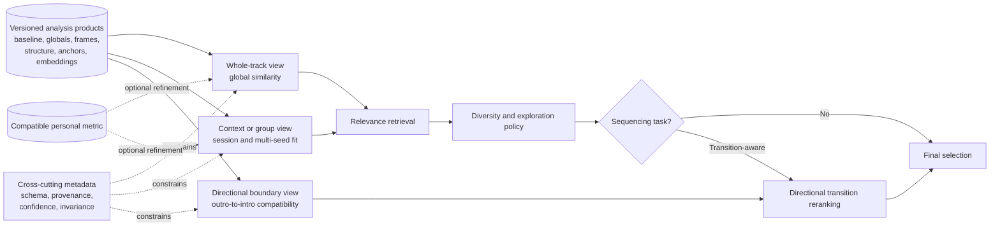
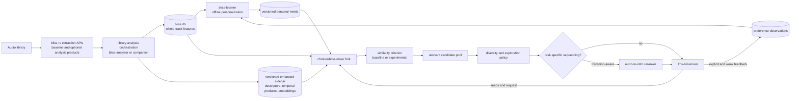
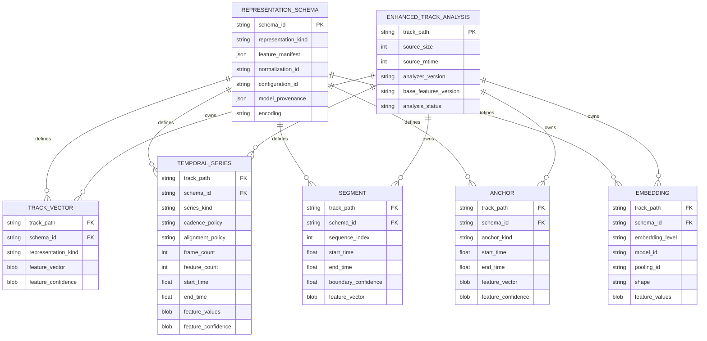
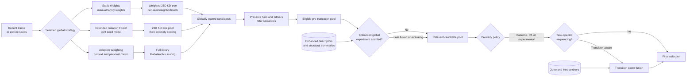
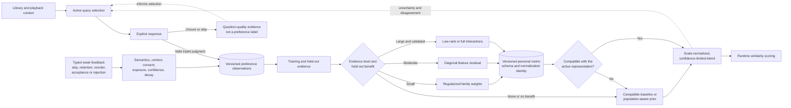
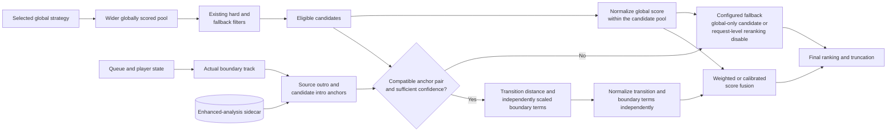

# Enhanced Bliss Similarity and Mixing Quality

**Status:** Living feature design; early draft for discussion  
**Last updated:** 2026-07-13  
**Scope:** `bliss-rs`, offline analysis tooling, the
[`chrober/bliss-mixer`](https://github.com/chrober/bliss-mixer) fork, and
`lms-blissmixer`

## Purpose of this document

This document is the shared design record for improving how Bliss represents,
compares, and selects music. The primary goal is better mixing quality through
better song-similarity criteria. Candidate improvements include psychoacoustic
descriptors, temporal structure, segmentation, structural variance, and
task-specific scoring. Transition-aware track selection is one important use
case enabled by those improvements, not the full scope of the design.

The document captures the current proposal, its evidence base, assumptions that
still need verification, and the decisions that remain open.

Detailed `bliss-rs` descriptor, temporal-representation, API, versioning, and
serialization design lives in the companion
[Bliss Analysis Evolution](https://github.com/chrober/bliss-rs/blob/feature/analysis-evolution/BLISS_RS_ANALYSIS_EVOLUTION.md)
document. This document remains the source of truth for cross-repository feature
goals, mixing architecture, personalization, task-specific scoring, evaluation,
and rollout.

The concrete mixing implementation discussed here is the
[`chrober/bliss-mixer`](https://github.com/chrober/bliss-mixer) fork and its LMS
integration. The companion `bliss-rs` design is intentionally player-neutral;
`bliss-rs` also serves the MPD ecosystem through applications such as
[`blissify-rs`](https://github.com/Polochon-street/blissify-rs).

It is intentionally not a final implementation specification. Sections marked
**Working proposal** describe the current preferred direction, while sections
marked **Open question** are expected to change as the design is refined.

## Executive summary

Bliss currently represents each track with a compact, versioned 23-feature
whole-track vector. The representation is efficient and useful, but it has four
potential limitations that this design investigates:

1. **Descriptor limitations:** some physical audio measurements may correlate
   imperfectly with perceived musical similarity. Psychoacoustic weighting,
   loudness modeling, or additional rhythmic and timbral descriptors may help.
2. **Temporal aggregation:** reducing a complete track to one vector can hide
   intros, outros, structural changes, and distinct musical sections.
3. **One representation serving several questions:** whole-song similarity,
   current-session coherence, and boundary-to-boundary transition quality are
   related but not identical objectives.
4. **Retrieval, variety, and ordering are conflated:** finding relevant tracks,
   choosing a varied subset, and arranging that subset into a good sequence are
   separate optimization problems.

The working proposal is therefore a layered enhancement programme:

1. preserve the existing 23-feature vectors and algorithms as the compatible
   baseline;
2. first test scoring and selection improvements that can use existing data,
   including population-aware weighting, learned personalization, and an
   explicit variety policy;
3. produce versioned, experimental analysis data offline through optional
   structured `bliss-rs` products and an application-owned sidecar, including
   perceptual descriptors, confidence estimates, and temporal representations;
4. evaluate which new data improves whole-track similarity and adaptive mixing;
5. use task-specific views of the analysis where appropriate; for example,
   structural summaries for global similarity and outro/intro anchors for
   transition-aware reranking.

No single proposed descriptor is assumed to be an improvement. New criteria
must be defined precisely and validated through retrieval tests and listener
feedback. The first implementation should establish an extensible analysis and
evaluation path rather than prematurely committing to a large new vector.

## Current system

The existing architecture is described in [ALGORITHMS.md](ALGORITHMS.md):

- `bliss-analyser` decodes audio and stores the current Bliss Version 2 vector
  in SQLite: tempo; zero-crossing rate; mean and standard deviation of spectral
  centroid, rolloff, and flatness; mean and standard deviation of loudness; and
  13 chroma-derived features. Version 1 contained 20 features; Version 2 added
  three chroma features. The vector contains both means and dispersions, but no
  MFCCs and no temporal ordering. See the public
  [`AnalysisIndex`](https://docs.rs/bliss-audio/latest/bliss_audio/enum.AnalysisIndex.html),
  [`Analysis`](https://docs.rs/bliss-audio/latest/bliss_audio/struct.Analysis.html),
  and [changelog](https://docs.rs/crate/bliss-audio/0.11.2/source/CHANGELOG.md).
- The upstream
  [`CDrummond/bliss-mixer`](https://github.com/CDrummond/bliss-mixer) reads
  those precomputed features and exposes the HTTP mixing API used by this
  design.
- The [`chrober/bliss-mixer`](https://github.com/chrober/bliss-mixer) fork
  retains that upstream behavior and adds variance-based weighting plus
  learned-matrix loading, direct use, and blending support.
- `lms-blissmixer` selects seeds, starts and calls the mixer fork, applies LMS
  integration behavior, and adds returned tracks to the queue.
- Static Weights and Extended Isolation Forest are inherited mixer strategies.
  The fork's variance-based Adaptive Weighting is a third strategy, with the
  learned matrix available as an optional metric extension rather than a fourth
  candidate-search algorithm.
- The integrated similarity survey and `bliss-learner` are a project-specific
  experiment added to `lms-blissmixer`, not an upstream `bliss-rs` capability.
  The learner is a standalone Rust port of the upstream
  `bliss-metric-learning` experiment. It learns a 23x23 Mahalanobis matrix from
  personal odd-one-out judgments. The `chrober/bliss-mixer` fork loads the
  resulting JSON artifact through `--matrix`; it can use the matrix directly
  for a single seed or blend it with seed-variance weighting for multiple
  seeds. See [METRIC_LEARNING.md](METRIC_LEARNING.md).

This proposal must preserve those algorithms and their existing fallbacks.
Enhanced analysis can augment their input or add optional post-processing, but
must not make the current database or behavior unusable.

## What MusicIP actually did

MusicIP is useful historical evidence, but its closed production analyzer is
not a specification that can be reconstructed from marketing descriptions.
This section separates documented behavior from attractive but unverified
claims.

### Analysis and identity

The [MusicIP patent](https://patents.google.com/patent/WO2005038666A1/en)
describes an acoustic attribute vector used for similarity separately from an
audio fingerprint used for identity. It lists possible attributes such as
tempo, energy, repeating-section proportion, rhythm, bass patterns, harmony,
instrument presence, and distances to musical classes. It also describes
possible normalization, mono conversion, and silence removal. A patent lists
possible embodiments; it does not prove that every described attribute shipped
in every MusicIP product.

The public `libofa` code is the Open Fingerprint Architecture component, not the
proprietary MusicIP similarity extractor. A PUID or fingerprint should therefore
not be treated as the secret similarity vector. The exact production feature
set, dimensionality, analysis interval, and distance function remain unknown.

### Context profiles and mix policy

The strongest documented MusicIP idea is hierarchical context. The patent
describes profiles for groups such as artists, albums, playlists, and moods,
using each attribute's deviation from the overall music population. It then
combines track-level acoustic distance with group-profile distance. In modern
terms, this is a library-relative, regularized context representation rather
than merely another audio descriptor.

One described coefficient is:

```text
profile_i = (group_mean_i - library_mean_i) / library_variance_i
```

That signed coefficient identifies how a group differs from the population.
The exact denominator should not be copied unquestioningly: standard deviation,
robust scale, shrinkage, and clipping are safer candidates for a modern
experiment.

The deployed [MusicIP HTTP
API](https://github.com/LMS-Community/slimserver/blob/public/9.2/Slim/Plugin/MusicMagic/HTML/EN/plugins/MusicMagic/html/docs/httpprotocol.html)
corroborates several user-visible behaviors: multiple seeds, moods, recipes,
filters, genre restrictions, repeat/reject controls, a `style` range, and a
separate `variety` setting. The distinction is important: relevance to a seed or
context and diversity within the returned set are different policies.

### Ordering and feedback

MusicIP also treated selection and ordering separately. Its documented smooth
shuffle minimized adjacent-track distance using a traveling-salesperson-style
ordering; jagged and sawtooth modes deliberately produced other trajectories.
The LMS integration also exposed more-like/less-like feedback, saved moods, and
playlist morphing. These ideas inform both this design and
[PATH_INTERPOLATION.md](PATH_INTERPOLATION.md), but they are not evidence that
MusicIP analyzed intro/outro anchors or optimized crossfades.

## Research foundation and evidence status

### Scope and research questions

This section is a working literature review for the mixer and interaction
layers. Descriptor extraction, temporal representations, uncertainty, and the
scientific lineage of the current Bliss vector are covered by the companion
[Bliss Analysis
Evolution](https://github.com/chrober/bliss-rs/blob/feature/analysis-evolution/BLISS_RS_ANALYSIS_EVOLUTION.md)
document. The purpose here is to determine what evidence supports candidate
retrieval, multi-seed context, diversity, personalization, sequencing, and
transition-aware reranking.

The review is organized around five research questions:

1. **RQ1 - objective separation:** Should relevance, diversity, coherence, and
   boundary compatibility be modeled and measured separately?
2. **RQ2 - context representation:** How should a multi-seed request, playlist,
   mood, or session be represented without erasing multimodality or leaking
   metadata identity?
3. **RQ3 - efficient personalization:** Which explicit and behavioral signals
   can improve a personal metric without requiring a long fixed survey?
4. **RQ4 - sequence and transition:** Which whole-track, local, directional,
   and structural evidence predicts a good next track or ordered path?
5. **RQ5 - validation:** Which offline, listener, and interaction measures
   would justify a production default rather than only a plausible prototype?

### Evidence interpretation

Three evidence labels are used implicitly throughout the design:

- **Supported direction:** music-specific experiments support the architectural
  separation or method family.
- **Adaptation evidence:** a method worked for a related representation,
  dataset, listener population, or recommendation task and merits a local test.
- **Local hypothesis:** the exact formula, feature, threshold, weight, or UX
  behavior has not been validated and must be compared with a simpler baseline.

No cited paper evaluates this exact combination of a personal LMS library,
Bliss Version 2 descriptors, the current Static/EIF/Adaptive algorithms, and
the proposed sidecar metadata. Results from streaming catalogs can also reflect
popularity, editorial practice, exposure, and platform UX that do not transfer
to a private collection. Published results therefore inform hypotheses and
experimental controls; they do not establish production defaults.

### Playlist quality is not one objective

Schweiger, Parada-Cabaleiro, and Schedl distinguish order-independent diversity
from order-dependent coherence. In their formulation, coherence relates local
adjacent-track deviation to variation across the full playlist [[1]](#m1). A
playlist may therefore be globally diverse and locally smooth, while a
homogeneous playlist can appear smooth under an adjacency-only measure without
having a meaningful trajectory.

Bittner et al. likewise separate sequencing a fixed playlist from optimizing
the rendered transition regions [[2]](#m2). Their small professional-curator
study supports the value of acoustic sequencing, but its scope is insufficient
to choose an algorithm or default for heterogeneous LMS libraries. Liebman et
al. independently describe preference learning and sequence planning as
separate components and include diversity and novelty in the planning reward
[[18]](#m18).

Together this evidence supports the logical separation of relevance retrieval,
diversity policy, and sequencing. It does not validate percentile-rank fusion,
the candidate-pool multiplier, one-step greedy continuation, or any proposed
score weight.

### Multi-seed and context representation

Logan directly studied acoustic recommendation from song sets and compared a
combined set model with mean, median, and minimum distances to individual set
members [[4]](#m4). For album completion with the studied timbre measure,
minimum distance performed best and median distance exceeded mean distance.
This does not establish minimum distance as a general rule: the labels were
album membership, the representation was timbral, and minimum distance can
overreact to an outlier. It does establish that aggregation is part of the
model and that a centroid cannot be assumed to be sufficient.

Context-aware recommendation studies provide adaptation evidence for keeping
intrinsic audio, listening history, cultural context, and situational context
as distinguishable inputs. Joint acoustic and cultural models improved the
reported recommendation results of Zangerle, Pichl, and Schedl [[16]](#m16),
and Pichl and Zangerle reported gains from combining acoustic and situational
contexts [[17]](#m17). These results support late fusion and context-specific
profiles, not the proposed population-distinctiveness equation.

The population-aware weighting formula and the choice among centre,
member-distance, and mixture representations therefore remain local
hypotheses. Their evaluation must include small, dispersed, and multimodal seed
sets plus artist- and album-disjoint controls.

### Task-specific and subjective similarity

Lee et al. model genre, mood, instrumentation, and tempo as distinct but
combinable similarity dimensions and report improvements over global and
specialized alternatives, including a listener study [[5]](#m5). This
supports a shared analysis layer with task-conditioned views rather than one
unqualified distance for every mixer operation.

Flexer, Lallai, and Rasi found higher agreement within the same listener than
between listeners, lower agreement in their single-genre study, genre influence
on judgments, and an effect from listener mood [[6]](#m6). Consequently,
"general similarity" labels are neither objective nor interchangeable with
transition or playlist-quality judgments. Evaluation should report rater
uncertainty and use labels that match the scoring task.

### Diversity and exploration

Nassif et al. compared Jaccard-based and relevance-aware submodular
diversification on Amazon Music [[7]](#m7). In their large online experiment,
the submodular treatment produced a statistically significant increase in
minutes streamed relative to the relevance-only baseline, while retaining item
relevance within the objective. This is direct evidence that a separate
diversification stage can improve a music recommender, but artist/album
categories and streaming engagement are not sufficient validation for Bliss
feature-space diversity.

MMR, clustering, submodular coverage, and DPP-like selection are therefore
candidate policies, not equivalent evidence-backed defaults. MMR originates as
a general relevance-versus-novelty reranking criterion [[19]](#m19). DPPs
provide a principled general model for selecting high-quality, mutually
dissimilar sets [[8]](#m8). Neither general method has a music- or
LMS-specific guarantee. Every policy must be compared on relevance, objective
diversity, repetition, order-dependent coherence, and listener perception.

### Explicit preference and active metric learning

Schultz and Joachims provide a foundational formulation for learning a distance
metric from relative comparisons [[9]](#m9). That supports the current
odd-one-out-to-triplet representation, while leaving the choice of loss,
regularization, and matrix capacity open.

Stochastic Triplet Embedding provides a probabilistic objective for learning an
item embedding from triplet judgments [[20]](#m20). It supports the algorithm
family used by the learner, but its original object-embedding problem is not the
same as learning a portable Mahalanobis transform over fixed Bliss features.

Tamuz et al. show that information-gain-driven relative-similarity questions
can reduce human comparison effort [[10]](#m10). Xiong et al. apply an
information-theoretic criterion specifically to active metric learning from
relative comparisons and report improvements over baseline query policies
[[11]](#m11). Both works support replacing uniform random questions with an
active experiment. Neither validates the current feature representation, the
proposed near-tie/disagreement heuristic, or fixed judgment thresholds for
family, diagonal, low-rank, and full models.

The required test is therefore a learning curve that holds model capacity and
evaluation data constant while comparing uniform-random and active queries.
Success means more held-out and playlist-level improvement per minute of user
effort, not merely higher training-triplet accuracy.

### Behavioral and authored-sequence evidence

Alonso-Jimenez et al. found playlist co-occurrence useful as weak supervision
for music representation learning, outperforming same-artist positive pairs for
their similarity evaluation [[12]](#m12). Ragno, Burges, and Herley infer
similarity and asymmetric transitions from adjacency in authored streams
[[14]](#m14), while Maillet et al. learn song-transition probabilities from
professional radio playlists and audio features [[15]](#m15). These results
support playlist and sequence data as contextual supervision. They do not show
that co-occurrence is an intrinsic acoustic similarity label or a particular
listener's stable preference.

Montecchio, Roy, and Pachet show that the within-track distribution of skips is
closely related to musical structure and can help train a structure predictor
[[13]](#m13). This is useful evidence, but also a warning: a skip may be
caused by a section boundary, queue position, interruption, or exposure rather
than dislike. Behavioral observations require event type, within-track time,
queue context, confidence, and decay. Explicit transition questions remain the
cleaner label for directional boundary quality.

### Boundary-aware sequence and transition evidence

Flexer et al. construct paths between start and end tracks and remove candidates
that are far from both endpoints [[3]](#m3). Their result supports global
relevance constraints before path construction and documents failure when the
catalog lacks plausible bridge material. It does not directly validate
one-step next-track selection.

Bittner et al. use key, mode, tempo, and learned acoustic features for
sequencing, then use structural boundaries, downbeats, beat-synchronous timbre,
chroma, loudness, and vocal presence to choose transition regions
[[2]](#m2). This is the closest direct support for boundary-aware analysis in
the proposal. Their system renders DJ-style crossfades, whereas the current LMS
proposal only chooses a next track. The fixed `outro_vector -> intro_vector`
distance is therefore a baseline inspired by the same task decomposition, not
a reproduction or validated simplification of that system.

### Research synthesis and working hypotheses

The mixer literature motivates the following falsifiable hypotheses:

- **H1 - layered optimization:** separating relevance, diversity, and
  sequencing improves controllability and listener outcomes over one overloaded
  nearest-neighbor score.
- **H2 - robust context profiles:** member-distance or clustered profiles
  outperform a single centre for dispersed or multimodal seed sets.
- **H3 - population distinctiveness:** library-relative evidence improves
  Adaptive Weighting beyond seed agreement alone after shrinkage and clipping.
- **H4 - task-conditioned similarity:** whole-track similarity, context fit,
  and directional transition quality require different views or weights.
- **H5 - efficient personalization:** active triplets provide more held-out
  improvement per user minute than uniformly random triplets.
- **H6 - typed weak feedback:** contextual playback and authored-sequence
  evidence improves a strong prior only when signal type, provenance, exposure,
  and uncertainty are preserved.
- **H7 - boundary evidence:** intro/outro and structure-aligned evidence improves
  directional transition judgments beyond whole-track distance.
- **H8 - calibrated fusion:** candidate-pool rank fusion is a useful prototype,
  but calibrated scores and explicit pool-quality confidence ultimately perform
  better.
- **H9 - separate outcome measures:** relevance, diversity, coherence,
  transition smoothness, and overall satisfaction cannot be replaced by one
  offline metric.

Negative results are useful. They can reject unnecessary descriptors,
over-capacity personal models, misleading feedback signals, or sequence
objectives that merely produce homogeneous playlists.

### Scientific bibliography

<a id="m1"></a>**[1]** H. Schweiger, E. Parada-Cabaleiro, and M. Schedl,
"[The Impact of Playlist Characteristics on Coherence in User-Curated Music
Playlists](https://link.springer.com/article/10.1140/epjds/s13688-025-00531-3),"
*EPJ Data Science*, vol. 14, article 24, 2025.

<a id="m2"></a>**[2]** R. M. Bittner, M. Gu, G. Hernandez,
E. J. Humphrey, T. Jehan, P. H. McCurry, and N. Montecchio,
"[Automatic Playlist Sequencing and
Transitions](https://archives.ismir.net/ismir2017/paper/000086.pdf)," ISMIR,
2017.

<a id="m3"></a>**[3]** A. Flexer, D. Schnitzer, M. Gasser, and G. Widmer,
"[Playlist Generation Using Start and End
Songs](https://www.cp.jku.at/research/papers/Flexer_etal_ISMIR_2008.pdf),"
ISMIR, 2008.

<a id="m4"></a>**[4]** B. Logan,
"[Music Recommendation from Song
Sets](https://shiftleft.com/mirrors/www.hpl.hp.com/techreports/2004/HPL-2004-148.pdf),"
ISMIR, 2004; HP Laboratories Technical Report HPL-2004-148.

<a id="m5"></a>**[5]** J. Lee, N. J. Bryan, J. Salamon, Z. Jin, and J. Nam,
"[Disentangled Multidimensional Metric Learning for Music
Similarity](https://www.justinsalamon.com/uploads/4/3/9/4/4394963/lee_disentangledmusicsim_icassp2020.pdf),"
ICASSP, 2020.

<a id="m6"></a>**[6]** A. Flexer, T. Lallai, and K. Rasi,
"[On Evaluation of Inter- and Intra-Rater Agreement in Music
Recommendation](https://doi.org/10.5334/tismir.107)," *Transactions of the
International Society for Music Information Retrieval*, vol. 4, no. 1,
pp. 182-194, 2021.

<a id="m7"></a>**[7]** H. Nassif, K. O. Cansizlar, M. Goodman, and
S. V. N. Vishwanathan,
"[Diversifying Music
Recommendations](https://pages.cs.wisc.edu/~hous21/papers/ICMLW16.pdf),"
Machine Learning for Music Discovery Workshop at ICML, 2016.

<a id="m8"></a>**[8]** A. Kulesza and B. Taskar,
"[Determinantal Point Processes for Machine
Learning](https://www.nowpublishers.com/article/Details/MAL-044),"
*Foundations and Trends in Machine Learning*, vol. 5, nos. 2-3,
pp. 123-286, 2012.

<a id="m9"></a>**[9]** M. Schultz and T. Joachims,
"[Learning a Distance Metric from Relative
Comparisons](https://papers.nips.cc/paper_files/paper/2003/hash/d3b1fb02964aa64e257f9f26a31f72cf-Abstract.html),"
NeurIPS, 2003.

<a id="m10"></a>**[10]** O. Tamuz, C. Liu, S. Belongie, O. Shamir, and
A. T. Kalai,
"[Adaptively Learning the Crowd
Kernel](https://icml.cc/2011/papers/395_icmlpaper.pdf)," ICML, 2011.

<a id="m11"></a>**[11]** S. Xiong, R. Rosales, Y. Pei, and X. Z. Fern,
"[Active Metric Learning from Relative
Comparisons](https://arxiv.org/abs/1409.4155)," arXiv:1409.4155, 2014.

<a id="m12"></a>**[12]** P. Alonso-Jimenez, X. Favory, H. Foroughmand,
G. Bourdalas, X. Serra, T. Lidy, and D. Bogdanov,
"[Pre-Training Strategies Using Contrastive Learning and Playlist Information
for Music Classification and Similarity](https://arxiv.org/abs/2304.12257),"
ICASSP, 2023, DOI 10.1109/ICASSP49357.2023.10095058.

<a id="m13"></a>**[13]** N. Montecchio, P. Roy, and F. Pachet,
"[The Skipping Behavior of Users of Music Streaming Services and Its Relation
to Musical
Structure](https://journals.plos.org/plosone/article?id=10.1371/journal.pone.0239418),"
*PLOS ONE*, vol. 15, no. 9, e0239418, 2020.

<a id="m14"></a>**[14]** R. Ragno, C. J. C. Burges, and C. Herley,
"[Inferring Similarity Between Music Objects with Application to Playlist
Generation](https://www.microsoft.com/en-us/research/publication/inferring-similarity-between-music-objects-with-application-to-playlist-generation/),"
ACM MIR, 2005.

<a id="m15"></a>**[15]** F. Maillet, D. Eck, G. Desjardins, and P. Lamere,
"[Steerable Playlist Generation by Learning Song Similarity from Radio Station
Playlists](https://ismir2009.ismir.net/proceedings/OS4-2.pdf)," ISMIR, 2009.

<a id="m16"></a>**[16]** E. Zangerle, M. Pichl, and M. Schedl,
"[User Models for Culture-Aware Music Recommendation: Fusing Acoustic and
Cultural Cues](https://transactions.ismir.net/articles/10.5334/tismir.37),"
*Transactions of the International Society for Music Information Retrieval*,
vol. 3, no. 1, 2020.

<a id="m17"></a>**[17]** M. Pichl and E. Zangerle,
"[User Models for Multi-Context-Aware Music
Recommendation](https://link.springer.com/article/10.1007/s11042-020-09890-7),"
*Multimedia Tools and Applications*, vol. 80, pp. 22509-22531, 2021.

<a id="m18"></a>**[18]** E. Liebman, P. Khandelwal,
M. Saar-Tsechansky, and P. Stone,
"[Designing Better Playlists with Monte Carlo Tree
Search](https://ojs.aaai.org/index.php/AAAI/article/view/19100)," AAAI,
vol. 31, no. 2, pp. 4715-4720, 2017.

<a id="m19"></a>**[19]** J. G. Carbonell and J. Goldstein,
"[The Use of MMR, Diversity-Based Reranking for Reordering Documents and
Producing Summaries](https://doi.org/10.1145/290941.291025)," SIGIR,
pp. 335-336, 1998.

<a id="m20"></a>**[20]** L. van der Maaten and K. Q. Weinberger,
"[Stochastic Triplet
Embedding](https://doi.org/10.1109/MLSP.2012.6349720)," IEEE International
Workshop on Machine Learning for Signal Processing, 2012.

## Problem statement

The existing 23-dimensional representation is a deliberately compact set of
whole-track statistics. It cannot retain every property that might matter to a
listener. Means, standard deviations, and chroma aggregates preserve more than
a simple average, but still discard section identity and temporal order. The
same fixed representation is then used for several different mixing objectives.

Potential failure modes include:

- two tracks are close in the current vector space but do not feel similar;
- a perceptually important difference is underrepresented, or an inaudible
  physical difference contributes too strongly;
- a structurally varied track lands at a synthetic average that resembles none
  of its actual sections;
- current seed tracks share a progression or structural character that a flat
  mean and variance do not express;
- a globally appropriate candidate begins in a way that conflicts with the
  current track's ending.

The design problem is to determine which additional descriptors and temporal
representations improve mixing, and how similarity criteria should select among
them for a particular task without discarding the strong existing baseline.

## Goals

- Improve perceived song similarity and overall mix quality in DSTM and other
  BlissMixer flows.
- Identify additional audio descriptors that measurably complement the current
  23 Bliss features.
- Preserve useful temporal information through windows, segments, anchors, or
  structural summaries where whole-track aggregation is insufficient.
- Allow different mixing tasks to use appropriate similarity criteria over a
  shared, versioned analysis foundation.
- Enable smoother consecutive-track transitions as one task-specific outcome.
- Preserve the current Bliss representation and algorithms as the baseline and
  compatibility fallback.
- Perform expensive audio analysis offline, not during an LMS mix request.
- Remain useful during partial rollout: missing enhanced data must degrade to
  current behavior rather than exclude tracks or fail a request.
- Keep metadata versioned and rebuildable.
- Make each proposed feature and scoring change measurable through retrieval
  evaluation and listener feedback.
- Reuse the existing learner and survey data while reducing the interaction
  cost of meaningful personalization.

## Non-goals

- Reimplementing MusicIP or claiming compatibility with its proprietary model.
- Replacing the existing 23-feature whole-track representation.
- Assuming that more descriptors or a larger vector automatically improve
  similarity.
- Building one universal similarity formula before the target tasks and
  evaluation criteria are defined.
- Requiring every user to train a personal metric before receiving good mixes.
- Beatmatching, key-locked DJ mixing, time stretching, or waveform-level audio
  rendering.
- Controlling the player's crossfade duration or DSP pipeline.
- Introducing mandatory network services or cloud analysis.
- Making segmentation, structural variance, or advanced perceptual masking a
  prerequisite for the first experimental pipeline.

## Terminology

- **Descriptor/feature:** A measured property of audio, such as tempo, a timbre
  coefficient, loudness, chroma, or a future experimental measurement.
- **Representation:** The collection and organization of descriptors used to
  describe a track, window, segment, or anchor.
- **Baseline vector:** The existing 23-feature whole-track Bliss vector.
- **Enhanced metadata:** Any versioned experimental descriptor or temporal
  representation added by this design.
- **Global score:** A whole-track or whole-context score produced by the selected
  existing or experimental similarity criterion.
- **Segment:** A time range intended to represent a coherent musical section.
- **Anchor:** A local analysis window representing an intro or outro.
- **Transition score:** A compatibility score between the current track's outro
  anchor and a candidate's intro anchor.
- **Candidate pool:** The tracks retained from the global algorithm before final
  truncation.
- **Reranking:** Reordering that candidate pool using transition information.
- **Structural variance:** A summary of how much a track's features change over
  its duration. The exact definition is not yet decided.
- **Feature confidence:** An estimate of whether a descriptor is reliable for
  this track, window, or segment; for example, tempo confidence or key
  ambiguity.
- **Invariance contract:** A statement of which transformations a descriptor
  should ignore and which it should preserve for a particular task.
- **Group profile:** A population-relative representation of an artist, album,
  playlist, mood, seed set, or session context.
- **Relevance:** How well a candidate matches the requested seed or context.
- **Diversity policy:** How redundancy and exploration are controlled among
  otherwise relevant candidates.
- **Sequencing:** Choosing the order of selected tracks, distinct from deciding
  which tracks belong in the set.
- **Personal metric:** A distance model learned from one listener's explicit or
  implicit preferences, currently represented by a 23x23 Mahalanobis matrix.
- **Strong feedback:** A deliberate similarity or transition judgment, such as
  an odd-one-out answer.
- **Weak feedback:** A behavioral signal such as skipping, completing, removing,
  or manually reordering a generated track. It is informative but ambiguous.

## Design principles

1. **Preserve a known baseline.** Every experiment must be comparable with the
   current 23-feature algorithms and capable of falling back to them.
2. **Match the representation to the question.** Whole-track similarity,
   structural similarity, session coherence, and transition compatibility may
   use different views of shared analysis data.
3. **Add evidence, not dimensions.** A descriptor belongs in production only if
   it improves a defined retrieval or listener outcome.
4. **Keep analysis offline and scoring cheap.** Audio decoding and temporal
   analysis do not belong in a live mix request.
5. **Global context constrains local criteria.** For transition-aware selection,
   a locally compatible intro must not pull an unrelated track from the whole
   library.
6. **Normalize before combining.** Static squared-Euclidean distance, isolation
   forest anomaly score, and adaptive Mahalanobis distance have different
   scales. Raw values cannot be mixed with an anchor distance using fixed
   coefficients.
7. **Graceful partial coverage.** A library can be analyzed incrementally.
8. **Version all derived data.** Changes to windowing or feature extraction must
   be detectable and rebuildable.
9. **Prefer evidence over plausible-sounding DSP.** Each added descriptor needs
   a definition, units, test data, and an evaluation purpose.
10. **Separate relevance, diversity, and sequencing.** A nearest-neighbor
    metric should not implicitly carry all three responsibilities.
11. **Make uncertainty explicit.** Unreliable tempo, key, segmentation, or
    short-window estimates should contribute less rather than masquerade as
    precise values.
12. **Define invariance per task.** Gain, encoding, silence trimming, absolute
    key, and boundary shape can be nuisance variables for one task and useful
    signals for another. There is no single universally correct enhanced
    vector.
13. **Personalization must be progressive.** Useful default behavior must not
    depend on a long survey. Personal feedback should refine a strong prior,
    with model capacity and influence increasing only as evidence accumulates.

### Logical layers

The design separates five layers even when an implementation combines them:

1. **Descriptors:** measured audio properties and their confidence.
2. **Representations:** track, window, segment, anchor, and group views derived
   from those measurements.
3. **Relevance retrieval:** candidates related to the seed or session context.
4. **Diversity policy:** a relevant subset with controlled redundancy and
   exploration.
5. **Sequencing:** an ordering that serves smoothness, transition quality, a
   destination, or another requested trajectory.

The same versioned analysis can support several task-conditioned views without
pretending that they share one universally correct distance. Confidence,
invariance, schema, and provenance constrain every view:



## Proposed architecture

### High-level flow



### Component responsibilities

#### `bliss-rs`

The companion [Bliss Analysis
Evolution](https://github.com/chrober/bliss-rs/blob/feature/analysis-evolution/BLISS_RS_ANALYSIS_EVOLUTION.md)
design is authoritative for extraction APIs and representation contracts.

Responsibilities:

- preserve the current Version 2 `Analysis` result and cost;
- expose reusable spectral, loudness, onset, tempo, chroma, tonal, and bass
  measurements without requiring consumers to duplicate decoding or DSP;
- provide optional analysis products such as global descriptor sets, aligned
  or typed frame series, structure, anchors, and model-identified embeddings;
- attach cross-cutting schema, provenance, confidence, and invariance metadata
  to those products;
- make requested products and their configuration explicit;
- version representation schemas and support deterministic serialization;
- keep player-specific persistence, retrieval, diversity, and sequencing out
  of the audio-analysis contract.

General-purpose novelty or segmentation primitives may live in the base crate,
behind a feature, or in a companion module. That ownership detail remains open;
reusable extraction itself belongs in `bliss-rs`.

#### Library analysis orchestration

**Working proposal:** extend `bliss-analyser` or introduce a small offline
companion, provisionally called `bliss-feature-analyser`, to request structured
`bliss-rs` products and persist them. It must not duplicate shared audio
extraction or decode audio inside `bliss-mixer`. The final binary and repository
ownership remain open.

Responsibilities:

- find tracks that have Bliss data but no current enhanced analysis;
- request configured, versioned analysis products from `bliss-rs`;
- run application-level experimental derivations that are not yet suitable for
  a stable library API;
- persist global descriptors, frame series, structure, segments, anchors,
  optional embeddings, and their cross-cutting metadata in application-owned
  storage;
- attach validity and confidence estimates where a measurement can be
  ambiguous or unstable;
- update metadata atomically and report failures without damaging existing
  Bliss data.

The production path should consume `bliss-rs` directly or through an explicitly
versioned binding. A prototype may compare external algorithms, but any retained
shared DSP should be upstreamed or isolated behind a compatible component rather
than becoming a second independent audio-analysis definition.

#### `chrober/bliss-mixer` fork

In this document, subsequent shorthand references to `bliss-mixer` mean the
[`chrober/bliss-mixer`](https://github.com/chrober/bliss-mixer) fork unless an
upstream repository is named explicitly.

Responsibilities:

- load enhanced metadata without requiring audio-analysis dependencies;
- support experimental similarity criteria alongside the existing algorithms;
- load a compatible personal metric and normalize it before blending with
  context-derived matrices;
- apply an optional, explicit diversity policy after relevance retrieval;
- expose comparable baseline and enhanced scores for evaluation;
- retain a larger globally suitable candidate pool when task-specific reranking
  requires it;
- identify the actual current boundary track;
- optionally calculate transition compatibility for candidates with anchor data;
- normalize global and transition scores over the pool;
- combine scores, apply existing filtering/fallback semantics, and return the
  requested count;
- expose useful diagnostics for tuning and evaluation.

#### `lms-blissmixer`

Responsibilities:

- expose enhanced similarity and transition experiments as opt-in settings
  during development;
- retain the existing survey and learner integration while making
  personalization useful at progressive evidence thresholds;
- collect weak feedback only with clear semantics, privacy boundaries, and an
  opt-out;
- pass analysis/scoring configuration and metadata location to `bliss-mixer`;
- package or locate the enhanced analyzer if this repository owns its
  distribution;
- surface analysis coverage/status where practical;
- preserve existing behavior when the new binary or metadata is absent.

## Enhanced analysis design

### Baseline and extension strategy

The existing 23 Bliss features remain the reference representation. Enhanced
analysis should initially store additional data separately rather than silently
changing the meaning or order of those features. This allows the same tracks to
be scored by both baseline and experimental criteria.

Separate metadata is an experimentation and compatibility strategy, not a
separate definition of shared audio extraction. Reusable descriptors, temporal
measurements, and representation contracts belong in `bliss-rs`; application
experiments can remain external until their algorithms and dependencies are
ready for a library API. LMS-specific orchestration and mixing policy remain in
the surrounding analyzer/mixer ecosystem.

### Flat and structured analysis boundary

The current proposed representation model is:

```text
Version 2 Analysis
  stable 23-feature flat baseline

Parallel bliss-rs analysis products
  optional schema-defined global descriptors
  optional aligned or typed frame series
  optional structure analysis and segments
  optional configured intro/outro anchors
  optional model-identified learned embeddings
  cross-cutting schema, provenance, confidence, and invariance metadata

Possible Version 3 Analysis
  only validated scalar summaries
  coexists with Version 2
  does not absorb variable-length structured products
```

Optional products are requested explicitly so a consumer that needs only the
baseline does not pay for dense temporal analysis. Detailed Rust API and schema
identity design belongs to the companion document.

Candidate feature families include:

- perceptually motivated timbre or spectral descriptors;
- perceived-energy, loudness-range, dynamics, crest-factor, and spectral-flux
  descriptors;
- tempo confidence and stability, pulse clarity, rhythmic density, onset
  regularity, and syncopation-related descriptors;
- bass-specific energy, onset, pitch-class, and rhythmic evidence;
- key/mode confidence, tonal stability, harmonic-change rate, and tonal
  trajectory;
- temporal statistics that retain more than a whole-track mean;
- repetition, segment, novelty, and structural-change descriptors;
- optional confidence-bearing instrument or source-character evidence;
- intro/outro anchors for directional transition scoring.

This list is a research backlog, not a proposed production vector. Each family
needs a precise hypothesis and an ablation against the baseline.

The priority is the missing mid-level musical layer between low-level aggregate
DSP and high-level metadata: rhythm, structure, energy development, temporal
harmony, and bass behavior. Instrument classifiers and embeddings are lower
priority because they add model, bias, licensing, and deployment concerns.

Each feature family must also declare an invariance contract. For global
similarity, a descriptor may ideally remain stable across codec changes, gain,
small trims, and alternate masters. For boundary scoring, gain trajectory,
fades, silence, and absolute tonal position may be exactly the information to
preserve. Intermediate measurements should be stored where practical so that
task-specific representations can apply different policies without decoding
the audio again.

### Temporal windows and segmentation

Windowed temporal evidence is a common foundation for structural variance,
segmentation, and transition anchors. Depending on the descriptor families, the
analyzer may retain one aligned sequence or several typed series at their native
cadences, then derive several representations:

- robust whole-track statistics beyond a single mean;
- a novelty curve or change-point candidates;
- a small set of coherent segment vectors;
- structural-variance descriptors;
- fixed intro and outro anchors.

Fixed windows are simpler and reproducible; content-aware segmentation may
better represent musical sections but adds algorithmic and schema complexity.
The first prototype should preserve the source series long enough to compare
both approaches instead of committing immediately to K-means or a particular
segmentation algorithm. Every series must declare its cadence and whether it is
native or resampled; alignment and resampling policy are part of representation
identity.

Useful intermediate forms include a self-similarity matrix, novelty curve, and
change-point confidence. They permit later comparison of robust statistics,
explicit segments, and distributional or sequence-aware distances without
assuming that musical sections form spherical clusters.

### Anchor windows

A fixed first and last 20-30 seconds is an intuitive starting point, not a
validated requirement.

The analyzer should define windows in terms of audible content, with explicit
handling for very short tracks and leading/trailing digital silence. Candidate
policies include:

- fixed-duration windows after conservative silence trimming;
- duration-relative windows with minimum and maximum lengths;
- windows ending immediately before the detected fade or track boundary;
- multiple short subwindows summarized into one anchor.

**Initial experiment:** compare fixed 15-, 20-, and 30-second anchors. Avoid
aggressive silence trimming until it is clear how intentional silence and fades
should behave.

### Anchor feature vectors

**Working proposal:** begin with the same feature semantics used by Bliss where
they can be meaningfully computed on a short window. This keeps transition
distance interpretable relative to the existing system.

Not every baseline feature is necessarily valid on a 15-30 second excerpt.
Tempo, chroma, and dispersion estimates need short-window stability tests and
per-vector confidence or validity flags. An anchor distance should ignore or
downweight a component that could not be estimated reliably.

The current 13 chroma-derived Bliss features are intentionally transposition
invariant: their templates are evaluated over pitch rotations. They describe
harmonic or interval character, not absolute key. If overlapping transitions
should prefer harmonically compatible keys, the anchor representation needs an
additional key-sensitive pitch-class, key/mode, or tonal-centroid descriptor.
This is optional transition evidence, not a reason to make global similarity
key-locked. See the Bliss [chroma
implementation](https://docs.rs/bliss-audio/latest/src/bliss_audio/chroma.rs.html).

The physical storage format is not yet chosen. A single scalar `intro_timbre`
or `outro_timbre` is insufficient because Bliss timbre and chroma are
multi-dimensional. The working storage direction is one
compact numeric vector/BLOB per track, anchor kind, and representation schema,
with start/end times and confidence stored alongside it. JSON is suitable for a
small human-readable schema manifest, not for bulk floating-point values. Exact
encoding remains authoritative in the companion `bliss-rs` design.

The selected format must encode schema identity, dimension, ordering,
normalization, and confidence layout, and must reject incompatible vectors.

### Loudness and boundary shape

Useful boundary descriptors may include:

- short-term or momentary loudness near the boundary;
- peak or true-peak level;
- loudness slope over the anchor;
- fade-in, fade-out, cold-start, and cold-end confidence;
- amount of effective silence at the boundary.

Terminology must follow the implemented measurement. In particular, a value
over the final few seconds should not be called EBU R128 _integrated loudness_,
which describes a programme-level gated measurement.

### Structural variance

Structural variance may help detect tracks for which whole-track averages are
least representative. It should not be assumed to mean "progressive music" or
used as a genre classifier.

One scalar called structural variance is probably too broad. It can also be
confounded by track duration, arrangement, and mastering. Candidate independent
descriptors include:

- repetition ratio or dominant-section share;
- feature-space path length normalized by duration or window count;
- novelty magnitude and confident change-point rate;
- section-distribution entropy;
- tempo and harmonic stability;
- loudness dynamics and range.

The analysis prototype should compute a small number of simple candidate
definitions once window vectors and evaluation data exist. A hard gate based on
an uncalibrated scalar risks reducing variety and rejecting otherwise good
matches or transitions.

### Incremental identity and invalidation

Path alone is compatible with current integration but is not enough to detect a
replaced file. Each analysis record should include, where available:

- canonical track path matching `TracksV2.File` semantics;
- file size and modification time, or another inexpensive content identity;
- analyzer version;
- feature-schema version;
- window-policy version;
- analysis timestamp and failure status.

Renames and library rescans need an explicit cleanup strategy.

## Metadata ownership and schema

Adding a table to the existing SQLite file is technically attractive because
lookup and joins are simple, but the database is owned by `bliss-analyser` and
its real schema uses `TracksV2`/`File`, not a generic `songs(filepath)` model.

Two options remain:

### Option A: extension tables inside `bliss.db`

Advantages:

- one file to configure and back up;
- direct joins;
- no cross-database consistency window.

Risks:

- an external component writes into a database it does not own;
- upstream migrations, replacement, or rebuild behavior may remove or conflict
  with extension tables;
- concurrent access and transaction behavior require verification.

### Option B: a sidecar enhanced-analysis database

Advantages:

- clear ownership and independent migrations;
- safe deletion and complete rebuilding;
- no assumptions about preservation of unknown tables by upstream tools.

Risks:

- path identity and stale-record cleanup must be coordinated;
- deployment needs one more configured file;
- `bliss-mixer` must load or attach two databases.

**Working preference:** use a sidecar database until preservation and locking
behavior of extension tables in `bliss.db` are verified. The logical model is
the same for either option.

### Logical model

The schema below is conceptual, not migration-ready. It follows the companion
storage contract while leaving exact column names and encoding implementation to
the database-owning analyzer:

```text
representation_schema
  schema_id                  primary representation identity
  representation_kind       global, frame series, segment, anchor, or embedding
  feature_manifest           names, units, ordering, invariance, confidence
  normalization_id
  configuration_id           window, hop, silence, and derivation policy
  model_provenance           nullable model, input, objective, augmentation,
                             and pooling identity
  encoding

enhanced_track_analysis
  track_path                 primary identity compatible with TracksV2.File
  source_size
  source_mtime
  analyzer_version
  base_features_version
  analysis_status
  analyzed_at
  error                      nullable

track_vector
  track_path
  representation_kind       enhanced global or structural summary
  schema_id
  feature_vector             compact versioned numeric vector
  feature_confidence         nullable validity/uncertainty data

temporal_series
  track_path
  series_kind                aligned or descriptor-family-specific series
  schema_id
  cadence_policy             window/hop or native measurement cadence
  alignment_policy           native or declared resampling policy
  frame_count
  feature_count
  start_time
  end_time
  feature_values             shaped dense series, normally one BLOB
  feature_confidence         optional shaped confidence data

segment
  track_path                 parent identity
  schema_id
  sequence_index
  start_time
  end_time
  boundary_confidence
  feature_vector
  feature_confidence

anchor
  track_path
  schema_id
  anchor_kind                intro or outro
  start_time
  end_time
  feature_vector
  feature_confidence

embedding
  track_path
  schema_id
  embedding_level            frame, segment, or whole track
  model_id                   immutable model/artifact identity
  pooling_id                 nullable, required for pooled representations
  shape
  feature_values             model-identified shaped BLOB
```

The relationships are easier to see as a conceptual entity model. It shows
ownership and schema reuse, not final table keys or migration syntax:



Dense frame data should use one shaped numeric BLOB per track and series rather
than one SQL row per feature value. Separate typed series may therefore occupy
separate rows without being forced onto a false common cadence. Segments remain
individual rows because their boundaries and vectors are independently
meaningful. Anchors remain small hot runtime rows. Embeddings use shaped BLOBs
and are accepted only with compatible model and pooling identity. A
self-similarity matrix should not be persisted by default; it can be regenerated
offline from retained frames.

Applications should distinguish:

- **hot runtime data:** global and structural summaries, anchors, and selected
  segment vectors loaded by `bliss-mixer`;
- **cold rebuildable data:** dense frame sequences and research intermediates
  used by offline analysis.

The physical schema may refine these logical tables, but it should not introduce
a competing representation contract. Manifests may use JSON; bulk numeric arrays
should use the shaped binary encoding defined by the companion design.

Before a physical schema is selected, the actual `bliss.db` schema, path
normalization, vector serialization cost, migration strategy, and concurrent
read/write behavior must be inspected.

## Similarity and mixing design

### Baseline and experimental whole-track similarity

The existing Static, EIF, and Adaptive algorithms remain the baseline. Enhanced
metadata can be evaluated in several ways without immediately replacing their
23-dimensional input:

- add one candidate descriptor family at a time and measure its effect;
- rerank baseline candidates using an independent enhanced-similarity score;
- extend a distance matrix only after new features are normalized and their
  contribution can be explained;
- compare whole-track mean vectors with robust temporal summaries;
- use structural similarity as a score, a confidence signal, or a pool-selection
  criterion;
- learn task-specific weights from listener judgments when enough directional
  or symmetric training data exists.

The first experiments should use late fusion or reranking because they preserve
an exact baseline result and make ablations straightforward. Expanding the core
Bliss vector is a later option that would require coordinated schema, matrix,
and compatibility changes across repositories.

### Relationship to existing mixing strategies

The three strategies documented in [ALGORITHMS.md](ALGORITHMS.md) are not
superseded by this proposal. They are alternative implementations of the global
relevance stage: each turns one or more recent tracks into a scored candidate
set. Enhanced analysis can change their input or scoring after validation;
diversity and transition awareness can operate as explicit layers after global
retrieval.

| Strategy | Current role | Direct relationship to this proposal | Main integration constraint |
|---|---|---|---|
| **Static Weights** | Applies four user-controlled feature-family weights, performs a separate 23-dimensional KD-tree search for each seed, and keeps the best per-seed score when merging results. | Remains the most interpretable control. Candidate perceptual or structural families can first be added through late fusion; validated families could later receive explicit controls or enter a rebuilt index. | Its preweighted KD-tree admits candidates using only the current representation. An enhanced scorer cannot recover a track excluded by that gate. Per-seed best-score merging also represents a union of neighborhoods rather than agreement with the complete context. |
| **Extended Isolation Forest** | Builds a joint anomaly model from the seed tracks, after constructing a candidate pool with the existing KD-tree. | Provides a distribution-based alternative to distance from a seed or centre. Standardized enhanced descriptors could be tested as forest input, while independent reranking allows safer ablation. | Equal treatment of dimensions makes scale, redundancy, and correlated descriptor families consequential. A high-dimensional forest trained from few seeds may be unstable, and its KD-tree prefilter uses a different criterion from its final anomaly score. |
| **Adaptive Weighting** | Computes a seed-variance Mahalanobis matrix, optionally blends the personal learned matrix, represents multiple seeds by their mean, and scans the full database. | Is the closest existing host for population-aware regularization, schema-aware personal metrics, enhanced scalar families, and more robust context representations. | Low variance proves seed agreement, not perceptual importance. A single mean can erase multimodal contexts, and every expanded matrix must match the exact feature schema, order, scale, and normalization. |

The intended layering is shown below. The filter box represents preservation of
the existing hard-exclusion and fallback semantics; its exact capture point in
each implementation remains subject to code-level review.



This leads to three integration rules:

1. **Preserve distinct baselines.** Static tests an interpretable manual metric,
   EIF tests joint distribution membership, and Adaptive tests a
   context-derived metric. An improvement against one does not establish that
   the other two should be removed.
2. **Separate global relevance from later policies.** The selected strategy
   should expose a scored pool before final truncation. The
   [diversity policy](#diversity-and-exploration-policy) and
   [transition reranker](#transition-aware-selection) then operate on that pool
   while preserving the hard and fallback filtering semantics described in
   [ALGORITHMS.md](ALGORITHMS.md#common-filtering-all-algorithms). Existing
   artist shuffle and Last.fm sampling are comparison policies, not equivalent
   implementations of perceptual diversity or transition compatibility.
3. **Measure candidate recall as well as reranking quality.** Reranking can only
   choose candidates admitted by the global stage. Static and EIF may require a
   wider KD-tree pool, a second enhanced index, or an experimental full scan.
   Adaptive already scans the library and is therefore the cleanest first host
   for an enhanced scoring experiment, but it must not become the only baseline
   by convenience.

For every experiment, record the original algorithm, original score and rank,
pool size, filter outcome, enhanced score and rank, and final selection. Compare
both quality within the retrieved pool and whether the baseline retrieval stage
omitted tracks that the enhanced criterion would otherwise rank highly.

### Population-aware adaptive weighting

A potentially high-value first experiment requires no new audio descriptors.
Current Adaptive Weighting rewards features on which the seeds have low
variance, approximately:

```text
seed_reliability_i = 1 / (seed_variance_i + epsilon)
```

Low seed variance means agreement, but not distinctiveness. A seed group can
agree on a value that is ordinary across the whole library, causing an
uninformative dimension to receive excessive weight. A MusicIP-inspired context
signal compares the seed centre with the library population:

```text
distinctiveness_i = abs(seed_mean_i - library_mean_i)
                    / (library_std_i + epsilon)

context_weight_i = blend(baseline_prior_i,
                         seed_reliability_i,
                         distinctiveness_i)
```

The blend needs shrinkage toward a baseline prior, clipping, and minimum sample
sizes. Library statistics must be robust to outliers and recomputed when the
analyzed population changes materially. This is an inference from MusicIP's
documented group-profile approach, not a claim that the formula reproduces its
production mixer. Existing work motivates comparing a seed set with both its
members and its surrounding population, but does not validate this particular
formula. It therefore remains a hypothesis requiring an ablation against the
current seed-variance method and simpler robust alternatives.

### Group and context profiles

The same population-relative representation can describe an artist, album,
playlist, saved mood, multi-seed request, or recent session. Such profiles may
improve cold-start context and express what is unusual about the group rather
than merely its centroid.

A group must not, however, be assumed to have one meaningful centre. A playlist
or listening session can be deliberately multimodal, and even an album can
contain outliers. Early work on acoustic recommendation from song sets found
that minimum and median member distances outperformed a combined set model and
mean distance for its album-completion task [[4]](#m4). That result is not a
universal aggregation rule, but it makes a centroid-only design scientifically
unjustified.

The prototype should compare at least:

- a normalized centroid and a robust or trimmed centre;
- mean, median, and minimum distance from a candidate to individual seed
  tracks;
- a small cluster or mixture representation for demonstrably multimodal sets;
- population-relative variants of each representation, with shrinkage for
  small groups.

The profile artifact should identify the aggregation method, source population,
member count, dispersion, schema version, and any cluster assignment. A query
should be able to fall back to per-member distances when a centre has low
support or high dispersion.

Profiles derived from metadata must remain distinguishable from audio evidence.
Artist or album identity can improve coherence but can also create popularity,
catalog-size, and same-artist leakage. Experiments should report acoustic-only,
profile-only, and fused results, with regularization for small groups. User-made
moods or accepted/rejected tracks may eventually provide safer behavioral
context than assuming every artist or album is homogeneous. Research combining
acoustic evidence with cultural or situational context supports testing such
fusion [[16]](#m16) [[17]](#m17), but not collapsing context into an intrinsic
audio descriptor.

### Diversity and exploration policy

After relevance retrieval, a separate policy should decide how much redundancy
to allow. Existing artist shuffling and external recommendations partially
serve this purpose, but do not make the tradeoff explicit or measurable.

Candidate prototype policies include:

- maximal marginal relevance, balancing seed relevance against similarity to
  already selected tracks;
- cluster coverage or round-robin selection across relevant neighborhoods;
- relevance-aware submodular coverage, which has direct music-recommendation
  evidence [[7]](#m7);
- a determinantal-point-process-like objective if a simpler method proves
  insufficient; DPPs provide a principled relevance/diversity model, but the
  general method is not itself evidence of benefit for this library
  [[8]](#m8).

The policy should expose one conceptual variety control and preserve hard
filters. Its evaluation should measure relevance and diversity separately.
Ordering then operates on the selected set or on a sufficiently broad frontier;
it should not silently compensate for a relevance model that returned near
duplicates. Diversity is order-independent, whereas playlist coherence depends
on local adjacency relative to the variation of the full sequence
[[1]](#m1). Objective feature dispersion, local flow, and perceived variety
must therefore be reported separately; maximizing any one of them can make a
playlist worse on the others.

### Learned personalization and feedback

#### Provenance and maturity

Four related pieces need to be distinguished:

1. [`blissify-rs`](https://github.com/Polochon-street/blissify-rs) is the
   upstream MPD application from the `bliss-rs` author. It analyzes and stores
   an MPD library, generates playlists with Bliss, and supports a Mahalanobis
   distance whose matrix is read from its configuration. It is the original
   application and storage context for the metric-learning experiment; it is
   not itself the learner.
2. [`bliss-metric-learning`](https://github.com/Polochon-street/bliss-metric-learning)
   is the author's separate, explicitly experimental Python prototype. Its
   local web survey presents three tracks from a `blissify-rs` library, stores
   the odd-one-out triplets, learns a matrix, and writes it back for
   `blissify-rs` to consume.
3. [`bliss-learner`](https://github.com/chrober/bliss-learner) is this
   project's public standalone Rust port of that training algorithm. It adapts
   the inputs and outputs to the LMS integration: triplets are read from JSON
   by filename, the 23 named Version 2 columns are read from `TracksV2`, and
   the learned matrix is emitted as JSON. It remains an independently
   maintained experiment, not an upstream component of Bliss.
4. `lms-blissmixer` supplies the survey UI, persists the triplets, launches the
   learner, reports progress, and passes the resulting artifact through
   `--matrix` to the [`chrober/bliss-mixer`](https://github.com/chrober/bliss-mixer)
   fork, which performs the actual Mahalanobis scoring and optional multi-seed
   blending.

The public upstream precedent is therefore
`blissify-rs` + `bliss-metric-learning`; the current LMS workflow is a derived
experiment. This lineage establishes technical feasibility, not evidence that
the learned model improves playlists reliably or that its interaction cost is
acceptable.

#### Current experimental integration

Metric learning is already an integrated experimental capability, not a future
placeholder:

1. `lms-blissmixer` presents three library tracks and records which one the
   listener considers the odd one out.
2. The two remaining tracks form the similar pair in a stored triplet.
3. `bliss-learner` reads the triplets and the 23 Bliss features, fits a full
   matrix factor with a regularized probabilistic triplet objective and
   cross-validated regularization, and writes the positive-semidefinite 23x23
   Mahalanobis matrix `M = L * L^T`.
4. The `chrober/bliss-mixer` fork loads that JSON through `--matrix`. For a
   single seed, Adaptive Weighting can use the learned matrix directly. For
   multiple seeds, the fork linearly blends it with the seed-variance matrix
   according to the configured learned-matrix influence.

The matrix is portable across tracks only while feature definitions, ordering,
scaling, and preprocessing remain compatible. Training triplets reference file
paths and are less portable than the resulting matrix.

#### Role and representation ceiling

The learned metric answers a useful question: which distinctions available in
the current representation matter to this listener? It can reweight features
and learn interactions between them, but it cannot reconstruct information that
the 23-feature vector never captured. Structural progression, absolute key,
intro/outro compatibility, or a missing perceptual descriptor require enhanced
analysis before personalization can learn to use them.

The learner is therefore both:

- an optional personalization layer over a baseline or enhanced
  representation; and
- evaluation infrastructure, because held-out triplets can compare the current
  metric, population-aware weighting, and candidate enhanced representations.

Odd-one-out labels normally describe symmetric whole-track similarity. They
must not be reused unmodified as labels for directional transition quality,
diversity, or sequence-level satisfaction.

#### Current UX and statistical limitations

The current survey draws three tracks uniformly at random. Many such triplets
have an obvious odd track, so they cost listening time while adding little
information about difficult nearest-neighbor decisions. At the same time, the
learner optimizes a full 23x23 factor from a relatively small number of answers.
The output matrix is symmetric, but this is still a high-capacity model relative
to roughly 100-200 noisy judgments.

The minimum accepted triplet count is only an execution threshold. It must not
be presented as evidence that the model is useful. With 100 triplets, a 20%
holdout contains only about 20 judgments, making accuracy and hyperparameter
selection noisy. Training-triplet accuracy can also improve without producing
better playlists.

**Working proposal:** personalization must remain optional and must never be a
prerequisite for good default mixing.

#### Active and progressive learning

The personalization lifecycle keeps observation semantics, model capacity,
validation, compatibility, and runtime influence separate. A weak signal enters
the learner only after its context is retained; more evidence increases model
capacity only when held-out results justify it:



The highest-priority learner experiment is active query selection. Rather than
uniform random triplets, choose questions expected to reduce uncertainty:

- use a familiar anchor from playback history, favorites, or a user-selected
  seed;
- present two plausible neighbors, not arbitrary tracks from the full library;
- prioritize cases where the baseline and current personal model disagree;
- prioritize near-ties or high-uncertainty comparisons;
- avoid repeated, trivially separable genre extremes;
- allow `unsure` or `skip` without treating it as a preference.

Relative comparisons are an established basis for distance-metric learning
[[9]](#m9). Information-gain selection has reduced the number of human
comparisons needed for similarity learning [[10]](#m10), including work aimed
specifically at active feature-space metric learning [[11]](#m11). This
supports the direction of active selection, but not a particular query heuristic
or evidence threshold in this implementation. Uniform-random selection remains
the required experimental control.

This should be combined with progressive model capacity:

1. **No judgments:** use the compatible baseline or population-aware metric.
2. **Small evidence set:** learn four regularized family weights for tempo,
   timbre, loudness, and chroma.
3. **Moderate evidence set:** learn a diagonal 23-feature residual.
4. **Large, validated evidence set:** allow low-rank or full-matrix feature
   interactions.

The personal model should be regularized toward a useful baseline matrix, not
merely toward a zero matrix. Its influence should depend on validation and
confidence as well as a manual blend setting. The UI should show learning
progress in terms of held-out improvement and uncertainty, and should stop
requesting feedback when additional rounds no longer add measurable value.

#### Weak and contextual feedback

Low-effort LMS behavior can supplement, but not replace, explicit judgments:

- quick skip versus substantial playback or completion;
- removal from or retention in a generated queue;
- manual reordering or manual choice among offered candidates;
- more-like/less-like actions;
- repeated acceptance or rejection of a transition.

These observations are affected by mood, interruption, familiarity, queue
position, and exposure bias. They need lower confidence weights, provenance,
decay, and preferably repeated evidence. A contextual micro-question such as
"which candidate fits better after this track?" may provide stronger
directional evidence with less effort than a separate long survey.

Playlist co-occurrence can provide useful weak supervision for music similarity
[[12]](#m12), but it represents collective playlist practice rather than one
listener's intrinsic similarity judgment. Skip timing is also correlated with
musical section boundaries [[13]](#m13), so a skip can encode structure,
position, or interruption rather than dislike. Weak signals must be evaluated
by type and context instead of being pooled into one implicit preference label.

#### Matrix compatibility and blending

Before learned personalization is relied on more broadly:

- include the Bliss feature version, descriptor schema, dimension, training
  model version, and normalization convention in the matrix artifact;
- validate finiteness, symmetry, and positive-semidefiniteness when loading;
- normalize learned and seed-derived matrices to a comparable scale before
  interpolation, for example by trace or a robust reference-distance statistic;
- report effective influence after normalization, because a linear coefficient
  is not a meaningful percentage when matrix scales differ;
- preserve the default metric if held-out judgments do not beat it by a
  meaningful margin;
- make cross-feature interactions visible in diagnostics rather than reporting
  only diagonal weights.

The implementation currently parameterizes and emits `M = L * L^T`. Related
documentation should use the same convention. `L^T * L` is also
positive-semidefinite, but mixing the two descriptions makes reproduction and
gradient review unnecessarily difficult.

### Transition-aware selection

Transition awareness is the first fully described task-specific scoring path.
It consumes anchor and boundary descriptors from the broader enhanced-analysis
model, but it is not required for experiments that improve general song
similarity.

The reranker operates only after global retrieval and existing filtering. It
uses the actual playback boundary, preserves candidates with missing metadata,
and combines scores only after normalizing their different domains:



#### Candidate generation

The selected existing algorithm runs first. It must retain more candidates than
the final requested count so the transition layer has meaningful choices.

Published systems commonly separate selection or a fixed input set from later
sequence optimization. Bittner et al. reorder a preselected playlist and then
optimize transition regions [[2]](#m2); Flexer et al. exclude tracks far from
both path endpoints before constructing an ordered path [[3]](#m3). These
results support global gating before local optimization, but do not determine
the correct pool size or filter boundary for this implementation.

The pool size should be configurable internally and measured. A fixed multiplier
such as 5x or 10x is a starting experiment, not a final default. Existing hard
filters and repeat behavior must not be weakened merely to fill the pool.

#### Boundary source

For transition scoring, the source is the single track whose audio will
immediately precede the new candidate. It is not the mean of the recent seed
window used by Adaptive Weighting.

The plugin and mixer must agree on which queued track is the actual boundary in
DSTM and manual mix flows, including queued-but-not-yet-played tracks.

#### Transition distance

The initial transition distance is:

```text
d_transition = distance(current.outro_vector, candidate.intro_vector)
```

The distance function may reuse the active static or learned metric when
compatible. Variance weights learned from several whole-track seeds may not be
appropriate for a single boundary pair and require validation.

Additional penalties can later represent loudness jumps or incompatible
boundary shapes, but each term must be normalized independently. Prior
transition work uses section boundaries, downbeats, beat-synchronous timbre,
chroma, loudness, and vocal presence rather than assuming that one arbitrary
fixed window contains all relevant evidence [[2]](#m2). The fixed
outro-to-intro vector is therefore a deliberately simple baseline. It must be
compared with structure-aligned regions and with feature-specific confidence;
the published work does not validate the exact distance or weights proposed
here.

#### Score normalization and fusion

A direct weighted sum such as `0.4 * global + 0.6 * transition` was considered.
Raw values cannot be combined that way because each global algorithm emits a
different score domain.

**Working proposal:** normalize within the candidate pool, then fuse:

```text
g = normalized global score, lower is better
t = normalized anchor distance, lower is better
l = normalized loudness/boundary penalty, lower is better

final_score = w_global * g + w_transition * t + w_loudness * l
```

Rank percentiles are a robust first normalization method that works across all
three global algorithms. Distribution-aware score normalization can be compared
later if score magnitude contains useful information that ranks discard.
Percentiles depend on the candidate-pool composition and erase absolute
confidence: the best member of a poor pool still receives the best rank. They
are therefore a prototype fusion mechanism, not the final calibrated model.

Initial experiments should keep `w_global` dominant or equal to the combined
local terms. The illustrative `0.4/0.6` split is a hypothesis, not a default.

#### Missing metadata

A candidate without transition data must remain eligible.

Possible fallback policies:

- rank it only by global score and renormalize the weights for that candidate;
- place analyzed candidates first only when their fused score is genuinely
  better;
- disable reranking for the whole request below a minimum coverage threshold.

The first policy gives the smoothest incremental rollout, but it must be tested
for systematic bias toward or against unanalyzed tracks.

#### Relationship to existing filtering

Transition reranking must preserve the common filters documented in
[ALGORITHMS.md](ALGORITHMS.md), including duration, BPM, genre, seasonal,
album, artist, and title constraints. Exact ordering needs implementation-level
review because some current filters retain fallback candidates rather than
discarding them permanently.

#### Relationship to path interpolation

[PATH_INTERPOLATION.md](PATH_INTERPOLATION.md) solves a different problem:
constructing several intermediate tracks between a known source and target.
Transition-aware mixing selects the next track from a global candidate pool.

The two features can eventually share anchor distance and evaluation utilities,
but neither should depend on the other for its first implementation.

## Psychoacoustic scope

Psychoacoustics should be treated as a source of hypotheses for the general
audio representation, not only for transition anchors, and not as a separate
runtime layer or a promise to reproduce MusicIP.

### Reasonable early work

- document the perceptual assumptions already present in spectral and chroma
  processing before adding another feature family;
- use a standards-based loudness implementation with correctly named outputs;
- test level normalization choices before comparing timbre;
- evaluate whether very low and very high frequency energy should influence
  perceived similarity as strongly as mid-band content;
- compare candidate perceptual descriptors with the current timbre, loudness,
  chroma, and tempo groups through feature-family ablations.

### Research work, not MVP assumptions

- simultaneous masking and spreading functions;
- temporal masking around transients;
- Bark-scale replacement of existing timbre features;
- learned perceptual embeddings;
- claims that a particular preprocessing chain models "what a human hears."

Bliss does not currently extract MFCCs. Applying A-weighting before hypothetical
MFCC extraction would therefore be a new pipeline rather than a correction to
the existing one. A-weighting is designed for particular sound-level
measurement contexts and is not automatically the correct preprocessing for a
new musical timbre descriptor. Any such experiment must be evaluated against
unweighted and loudness-normalized baselines.

## User experience and configuration

The development version should expose as little configuration as possible:

- enhanced similarity experiments: off/on or an explicitly named experimental
  method;
- variety policy: off/on, with at most one advanced influence control;
- transition-aware reranking: off/on;
- transition influence: one advanced slider, if needed for evaluation;
- personalization: optional, with the existing learned-matrix influence kept as
  an advanced control rather than a prerequisite;
- feedback progress: judgments collected, current model tier, held-out evidence,
  and whether more answers are expected to help;
- analysis status/coverage: informational;
- rebuild enhanced analysis: maintenance action.

Feature families, segment policy, anchor duration, normalization method,
candidate-pool multiplier, and individual DSP weights should remain experimental
settings or command-line options until there is evidence that users benefit from
controlling them.

All enhanced methods should initially default to **off** until analysis
migration, fallback behavior, evaluation, and performance are proven.
Personalization is different: the unpersonalized baseline remains the default,
while an existing compatible personal matrix may continue to be opt-in. The UI
should invite short, resumable feedback sessions rather than imply that users
must complete 100 or more rounds before BlissMixer becomes useful.

## Observability

Debug output should make a decision explainable without logging raw audio:

- active feature schema and representation type;
- selected global algorithm and seed tracks;
- baseline and enhanced global ranks/scores when an experiment is active;
- enhanced-analysis coverage and missing-feature fallbacks;
- actual boundary source track;
- candidate pool size and anchor-data coverage;
- relevance-versus-diversity contributions and duplicate suppression;
- normalization method and active weights;
- personal-metric schema, model tier, validation confidence, normalization,
  effective blend contribution, and fallback reason;
- for top candidates: global rank/score, transition rank/distance, loudness
  penalty, final score, and missing-data fallback;
- analysis/schema version mismatches;
- time spent in global search, metadata lookup, and reranking.

## Performance expectations

- Audio decoding and feature extraction happen offline.
- Runtime metadata should be loaded or indexed so scoring does not perform an
  SQLite query per descriptor or candidate.
- Normal mixing should load only hot summaries, anchors, and selected segments;
  dense frame sequences remain cold unless an explicit algorithm needs them.
- `bliss-rs` analysis products should be opt-in so Version 2-only consumers do
  not pay segmentation or frame-retention cost.
- Shared transforms and intermediate measurements should be reused instead of
  decoding or computing parallel independent definitions of the same evidence.
- Enhanced similarity and task-specific reranking should add only a small
  fraction of the existing mix-request latency.
- Memory use should be measured with a realistic library, especially if window,
  segment, or anchor vectors are retained in memory.

No numeric latency or memory budget is committed until a prototype establishes
a baseline on the project's target hardware.

## Evaluation plan

### Dataset and fixtures

Create a small, redistributable or locally configured evaluation set containing:

- listener judgments about which tracks or pairs feel similar;
- tracks with similar current Bliss vectors but clearly different perceived
  character, and the inverse;
- alternate versions or sections that expose timbre, loudness, rhythm, and
  structure behavior;
- fade-out to fade-in and cold-start combinations;
- quiet-to-loud and loud-to-quiet boundaries;
- stable and structurally varied tracks;
- short tracks and tracks with leading/trailing silence;
- cases where global similarity and local compatibility disagree.

### Automated validation

- deterministic extraction for fixed audio fixtures;
- descriptor units, ranges, normalization, and invariance tests;
- confidence calibration and behavior when a feature is invalid or ambiguous;
- window, segmentation, anchor-boundary, and short-track tests;
- schema-version and stale-file invalidation tests;
- learned-matrix dimension, version, finiteness, symmetry,
  positive-semidefiniteness, and scale-normalization tests;
- baseline-versus-enhanced nearest-neighbor regression reports;
- score normalization tests for all three global algorithms;
- missing-metadata and mixed-version fallbacks;
- no regression in existing filters and repeat handling;
- runtime and memory benchmarks on a large synthetic metadata set.

### Task-specific evaluation

Evaluation labels must match the scoring task:

- general song similarity is usually a symmetric pair or triplet judgment;
- transition quality is directional (`A -> B`) and boundary-dependent;
- playlist/session fit is a set- or sequence-level judgment involving
  coherence, coverage, repetition, and trajectory.

One label type should not be silently reused as ground truth for another.

### General similarity evaluation

Evaluate new descriptors and representations through:

- nearest-neighbor inspection against the current 23-feature baseline;
- held-out similarity triplets from the existing or an extended survey;
- feature-family ablation: baseline plus exactly one new family at a time;
- retrieval consistency across quiet/loud masters, short/long tracks, and
  structurally simple/complex tracks;
- playlist-level ratings for coherence, relevance, and variety.

Structural and temporal features need their own ablations. A higher-dimensional
model that merely memorizes the evaluation library is not an improvement.

### Context-profile, diversity, and coherence evaluation

Evaluate multi-seed and group representations on both compact and deliberately
multimodal contexts. Compare:

- normalized centroid, robust or trimmed centre, and a combined-set model;
- mean, median, and minimum candidate-to-member distance;
- one-centre and small clustered or mixture profiles;
- seed-only, population-relative, metadata-context-only, and late-fused scores.

Use album and artist completion only as diagnostic proxy tasks. The primary
tests should use held-out user-made playlists, saved contexts, or session
continuations, with artist- and album-disjoint splits where practical. Report
dispersion and performance by group size so a method is not rewarded merely for
identifying a repeated artist or album.

For selected result sets and sequences, compare relevance-only ranking with
MMR, cluster coverage, relevance-aware submodular selection, and, only if
needed, a DPP-like method. Report at least:

- seed or context relevance;
- intra-list diversity and artist/album repetition;
- global feature variation;
- adjacent-track distance and local-versus-global coherence;
- listener-rated relevance, variety, flow, and boredom.

Include random-order controls and retain the same candidate frontier across
policy comparisons. A method that increases objective diversity without
improving perceived variety, or that improves local smoothness by making the
whole sequence homogeneous, has not validated the design goal.

### Personalization evaluation

Evaluate personalization as a learning curve, not at one arbitrary survey
count. At several evidence thresholds, compare:

- the compatible unpersonalized baseline;
- population-aware or group-profile weighting;
- family-only, diagonal, low-rank, and full-matrix personal models;
- uniform-random versus active triplet selection;
- explicit judgments alone versus explicit plus lower-weight weak feedback;
- each weak signal type separately before any combined behavioral model.

Report held-out triplet accuracy with uncertainty, but also blind playlist
ratings and nearest-neighbor changes. Split evaluation by listener and, where
practical, by track or artist so repeated entities do not make generalization
look easier than it is. Record survey time, skips, abandoned rounds, and useful
improvement per judgment. The target is not merely a more accurate learner; it
is a useful improvement with a tolerable interaction cost.

### Transition evaluation

Run blind comparisons of:

- current global-only ordering;
- global plus anchor reranking;
- anchor reranking with and without loudness penalties;
- fixed-window versus structure-aligned anchors;
- whole-track, boundary-specific, and learned distance functions;
- alternative candidate-pool sizes, anchor lengths, normalization methods, and
  score weights.

Collect separate ratings for transition smoothness, next-track appropriateness,
and overall variety. A transition can be locally smooth while being globally
boring or semantically wrong; one rating must not stand in for all three.

The existing metric-learning survey can provide general similarity judgments.
Transition feedback therefore needs different training/evaluation data from
symmetric song-similarity triplets.

Where structural analysis is available, separately ablate section-boundary,
downbeat, timbre, chroma, loudness, and vocal-presence evidence. This tests
whether the inexpensive fixed-anchor baseline is sufficient and prevents a
complex transition model from receiving credit for one dominant feature.

## Delivery phases

These are downstream experimentation and integration phases, not lockstep
milestones for the companion `bliss-rs` roadmap. An application-level analyzer
may derive experimental summaries or anchors from a frame API before equivalent
stable library products exist; reusable extraction and final representation
contracts still follow the ownership boundary above.

### Phase 0: discovery

- inspect the exact `bliss.db` schema and lifecycle;
- document the current 23-feature extraction, ranges, normalization, and known
  behavior as the measurable baseline;
- align with the companion `bliss-rs` baseline/API discovery and representation
  schema work;
- verify short-excerpt validity for candidate features rather than assuming
  whole-track semantics transfer to bounded slices;
- identify orchestration and persistence extension points in `bliss-analyser`
  and loading/scoring extension points in `bliss-mixer`;
- define path normalization and cross-platform binary packaging constraints;
- confirm sidecar lifecycle, attachment, locking, and cleanup behavior.

### Phase 1: scoring and selection experiments with existing data

- add reproducible library-population statistics;
- test regularized population-aware Adaptive Weighting;
- compare centre, robust member-distance, and small clustered multi-seed
  profiles on compact and multimodal contexts;
- version and scale-normalize the existing learned-matrix artifact;
- establish learning curves for the current random survey and full matrix;
- prototype active triplet selection and progressive family/diagonal models;
- prototype MMR, cluster coverage, and relevance-aware submodular selection;
- establish separate relevance, diversity, and local-versus-global coherence
  measures;
- retain an exact baseline path and avoid schema changes where possible.

### Phase 2: analysis prototype

- consume an experimental structured `bliss-rs` frame API for a controlled
  library subset;
- store representation manifests, shaped frame series, hot summaries, and
  confidence in versioned sidecar metadata;
- derive initial structural summaries and intro/outro anchors;
- implement a small number of psychoacoustic or additional-feature hypotheses
  with precise definitions;
- create repeatable baseline, ablation, and listener-evaluation reports.

### Phase 3: enhanced global similarity experiments

- load enhanced metadata in `bliss-mixer`;
- compare late-fusion or reranking approaches with the existing Static, EIF, and
  Adaptive results;
- evaluate structural summaries and perceptual descriptors independently;
- preserve exact baseline and missing-data fallback paths;
- retain only feature families that demonstrate a measurable benefit.

### Phase 4: opt-in transition-aware scoring

- load anchor and boundary metadata in `bliss-mixer`;
- rerank a global candidate pool using normalized rank fusion;
- compare fixed and structure-aligned anchors plus whole-track and
  boundary-specific distances;
- add key-sensitive tonal evidence only if harmonic-transition evaluation
  justifies it, with confidence-aware fallback;
- preserve existing fallbacks and filters;
- add plugin configuration and diagnostics;
- run listener evaluation before selecting defaults.

### Phase 5: segmentation and structural modeling

- compare fixed-window summaries with content-aware segments;
- determine whether structural data improves global similarity, adaptive
  context, reranking, candidate-pool sizing, or confidence;
- avoid hard gating until listener results justify it.

### Phase 6: advanced psychoacoustic research and hardening

- evaluate masking, alternative scales, and learned perceptual representations
  against the retained Phase 3 baseline;
- adopt only improvements that survive blinded comparison and deployment-cost
  review;
- decide which proven scalar descriptors meet the companion document's
  promotion criteria for a possible `FeaturesVersion::Version3`; frames,
  structure, anchors, embeddings, and their cross-cutting metadata remain
  parallel products.

## Risks and mitigations

| Risk | Mitigation |
|---|---|
| More features make similarity worse or overfit one library | Require feature-family ablations and held-out listener judgments. |
| Seed agreement overweights an ordinary feature | Blend seed reliability with population distinctiveness, shrinkage, and a baseline prior. |
| One centroid erases a multimodal seed or context | Compare member-distance, robust-centre, and clustered representations; use dispersion to choose or fall back. |
| Group profiles leak artist/album identity instead of musical evidence | Report audio-only and profile-only ablations; regularize small groups. |
| Relevance optimization returns near duplicates | Apply and evaluate a separate diversity policy. |
| Objective diversity does not match perceived variety | Report listener ratings beside feature-space diversity and repetition metrics. |
| Personalization requires an exhausting survey | Use active queries, short resumable sessions, progressive model capacity, and a useful default prior. |
| A full learned matrix overfits sparse personal judgments | Compare family, diagonal, and low-rank models; increase capacity only with held-out evidence. |
| Random triplets are obvious but uninformative | Query plausible neighbors, model disagreements, and uncertain cases. |
| Weak playback feedback is mistaken for preference | Store provenance and context; evaluate signal types separately; use lower confidence, decay, and repeated evidence. |
| A skip caused by a section boundary is learned as dislike | Retain within-track time and queue context; do not convert isolated skips directly into preference triplets. |
| Learned and seed-derived matrices have incompatible scale | Normalize both against a declared convention before blending. |
| A learned matrix is applied to incompatible Bliss features | Embed feature and model schema versions and reject mismatches. |
| Experimental features silently change baseline semantics | Store them separately and version every representation. |
| The enhanced analyzer duplicates or diverges from `bliss-rs` DSP | Consume structured `bliss-rs` products and isolate only explicitly experimental external algorithms. |
| Dense temporal data slows normal mixing | Separate hot runtime products from cold rebuildable frame sequences. |
| A future Version 3 silently invalidates matrices and consumers | Promote only proven scalars through coordinated feature-version migration; keep Version 2 available. |
| Segmentation adds complexity without useful signal | Compare with fixed-window and robust-statistics baselines first. |
| Locally smooth but globally inappropriate tracks | Global candidate generation remains the first-stage gate. |
| Raw scores from different algorithms are incomparable | Normalize within the candidate pool before fusion. |
| Enhanced metadata covers only part of the library | Candidate-level fallback and coverage diagnostics. |
| File paths become stale after library changes | Store source identity, version analysis, and implement cleanup. |
| Window, segment, and anchor vectors increase database and memory size | Prototype serialization choices and benchmark realistic libraries. |
| Unknown tables are lost during a Bliss database rebuild | Prefer a sidecar DB until lifecycle behavior is verified. |
| DSP complexity makes deployment fragile | Keep analysis offline and phase advanced psychoacoustics separately. |
| A smoothness objective reduces variety | Evaluate variety independently and cap transition influence. |
| Structural variance becomes a genre proxy | Treat it as confidence/context, not a genre label; avoid early hard gates. |
| Short anchors produce unstable tempo or tonal estimates | Store confidence/validity and downweight unreliable components. |
| Rank fusion makes a weak candidate pool look confident | Log pool quality and later compare calibrated score fusion. |
| A useful invariance for one task erases another task's signal | Define invariance contracts per descriptor and task. |
| Crossfade behavior differs by player | Optimize selection only; test with representative LMS playback setups. |

## Open questions

The following questions should drive the next design discussions. Detailed
`bliss-rs` API questions remain in the companion document rather than being
duplicated here.

1. What sidecar lifecycle, attachment, locking, cleanup, and retention policy
   works across supported LMS deployments?
2. Which specific shortcomings of the current 23 features can be demonstrated
   with reproducible examples or listener judgments?
3. Which mid-level feature family should be tested first: rhythm/onset behavior,
   repetition/structure, dynamics/energy, temporal harmony, or bass behavior?
4. Can existing Bliss feature extraction operate correctly on bounded slices,
   and which features remain stable on short windows?
5. Which dense frame products should be retained as cold rebuildable data, and
   which summaries, segments, or anchors must remain hot for runtime scoring?
6. How should structural variance be defined, normalized, and evaluated?
7. Does population-aware Adaptive Weighting improve the existing algorithm
   before any new DSP features are added?
8. Which diversity policy - MMR, cluster coverage, relevance-aware submodular
   selection, or a DPP-like method - gives useful exploration without
   sacrificing seed relevance?
9. Which group profiles and aggregation methods - robust centre, member-distance
   statistic, or clustered mixture - add value beyond leaking metadata identity?
10. How many actively selected judgments are needed for family, diagonal,
    low-rank, and full personal models to beat the default reliably?
11. Which LMS behaviors are sufficiently interpretable to use as weak feedback,
    and what privacy/retention policy should govern them?
12. How should personal-metric confidence control its effective blend without
    exposing unnecessary configuration?
13. Should experimental global similarity use vector expansion, a separate
   distance, late fusion, or learned weights?
14. What is the exact boundary track for every LMS request flow?
15. At what point in each current algorithm should the pre-rerank pool be
   captured, relative to hard and fallback filters?
16. Is percentile rank fusion sufficient, or does calibrated score normalization
   produce better results?
17. How should candidates without enhanced analysis be treated during partial
   rollout?
18. Do fixed or structure-aligned anchors work better, and which duration and
    silence policy produces the best listener ratings?
19. Does key-sensitive tonal compatibility improve real LMS transitions, and
    how should ambiguous key estimates be handled?
20. Which loudness and boundary-shape descriptors add value beyond anchor vectors?
21. Which repository should own and release the enhanced analyzer binary?
22. How should analysis be triggered after new tracks are added?
23. What minimum listener-study result would justify enabling any enhancement by
    default?
24. Which local-versus-global coherence measure predicts listener-rated flow
    without rewarding homogeneous or boring playlists?

## Historical and implementation evidence

- Bliss [`Analysis`](https://docs.rs/bliss-audio/latest/bliss_audio/struct.Analysis.html)
  and [`AnalysisIndex`](https://docs.rs/bliss-audio/latest/bliss_audio/enum.AnalysisIndex.html)
  document the versioned 23-feature representation. The companion document is
  authoritative for its scientific rationale and proposed evolution.
- The Bliss [changelog](https://docs.rs/crate/bliss-audio/0.11.2/source/CHANGELOG.md)
  records the Version 2 chroma additions, and the [chroma
  source](https://docs.rs/bliss-audio/latest/src/bliss_audio/chroma.rs.html)
  shows pitch-rotation-based, transposition-invariant templates.
- The [MusicIP patent](https://patents.google.com/patent/WO2005038666A1/en)
  is evidence for described acoustic attributes, fingerprints, group profiles,
  and ordering methods, but not proof that every embodiment shipped or that the
  inferred population-weighting formula is correct.
- The deployed [MusicIP HTTP
  API](https://github.com/LMS-Community/slimserver/blob/public/9.2/Slim/Plugin/MusicMagic/HTML/EN/plugins/MusicMagic/html/docs/httpprotocol.html)
  and [LMS plugin
  source](https://github.com/LMS-Community/slimserver/blob/public/9.2/Slim/Plugin/MusicMagic/Plugin.pm)
  corroborate user-visible seed, mood, recipe, style, variety, and filtering
  behavior.
- The public [`libofa` source
  package](https://sources.debian.org/src/libofa/0.9.3-15/) is fingerprinting
  code; it is not treated here as the MusicIP similarity implementation.

## Related documents

- [Bliss Analysis Evolution](https://github.com/chrober/bliss-rs/blob/feature/analysis-evolution/BLISS_RS_ANALYSIS_EVOLUTION.md)
  - companion `bliss-rs` design for descriptor extraction, structured temporal
  representations, feature versioning, serialization, and analysis performance.
- [ALGORITHMS.md](ALGORITHMS.md) - current candidate-generation algorithms and
  shared filtering behavior.
- [METRIC_LEARNING.md](METRIC_LEARNING.md) - learned Mahalanobis matrix and
  existing listener survey.
- [PATH_INTERPOLATION.md](PATH_INTERPOLATION.md) - multi-track paths toward a
  known destination, a related but distinct feature.

## Related implementations

- [`bliss-learner`](https://github.com/chrober/bliss-learner) - this project's
  public but experimental standalone Rust port, adapted to the LMS survey,
  `TracksV2` schema, JSON artifacts, and progress notifications; it is not an
  upstream Bliss component.
- [`chrober/bliss-mixer`](https://github.com/chrober/bliss-mixer) - the fork
  that adds variance-based Adaptive Weighting and learned-matrix support to the
  upstream mixer. It loads `bliss-learner` output through `--matrix`, applies
  its Mahalanobis metric directly for a single seed, and can blend it with
  seed-variance weighting for multiple seeds.
- [`bliss-metric-learning`](https://github.com/Polochon-street/bliss-metric-learning)
  - the `bliss-rs` author's explicitly experimental Python survey and metric
  trainer from which `bliss-learner` ports the core algorithm.
- [`blissify-rs`](https://github.com/Polochon-street/blissify-rs) - the
  `bliss-rs` author's MPD application and the original database, playlist, and
  Mahalanobis-matrix consumption context for `bliss-metric-learning`.
