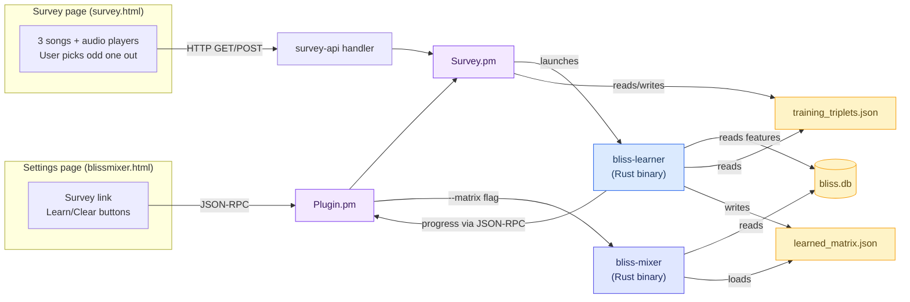

# BlissMixer Metric Learning -- Implementation Overview

This document describes the metric learning survey feature added to the
lms-blissmixer LMS plugin.  The feature lets users train a personalised
Mahalanobis distance matrix through an "odd-one-out" survey.  The trained
matrix is then used by the bliss-mixer binary (via its `--matrix` flag) to
improve similarity searches — either as the sole distance metric for
single-seed requests or blended with the variance-based matrix for
multi-seed requests.

The implementation is based on
[bliss-metric-learning](https://github.com/Polochon-street/bliss-metric-learning)
by Polochon-street.  The learning algorithm was ported from Python to Rust
in the standalone [bliss-learner](https://github.com/chrober/bliss-learner)
binary, eliminating the previous Python/numpy runtime dependency.


## Architecture at a Glance




## Files

### Perl -- Plugin Integration

| File | Role |
|------|------|
| `Plugin.pm` | Dispatches `survey` CLI commands to `Survey.pm`.  Passes `--matrix` to bliss-mixer when `learned_matrix.json` exists. |
| `Survey.pm` | All survey logic: HTTP handlers, CLI actions, bliss-learner binary detection, learning process management. |
| `Settings.pm` | Injects template variables (button labels, strings) into the settings page. |
| `strings.txt` | EN/DE string definitions for survey/learning UI elements. |

### Rust -- Metric Learning

| Binary | Role |
|--------|------|
| `bliss-learner` | Standalone Rust binary.  Reads training triplets (JSON) and bliss features (SQLite), runs cross-validated L-BFGS-B optimisation, writes `learned_matrix.json`.  No runtime dependencies beyond the binary itself.  Pre-built for Linux (x86_64, aarch64, armhf), macOS, and Windows. |

### HTML/JS -- User Interface

| File | Role |
|------|------|
| `settings/blissmixer.html` | Settings page.  "Metric Learning" collapsible section with survey link, triplet count, matrix status, learn/clear buttons.  Shows a warning if the bliss-learner binary is not found. |
| `survey.html` | Standalone survey page.  Presents 3 songs with audio players; user picks the odd one out. |


## Data Flow

### 1. Survey (Collecting Training Data)

1. User opens the survey page (`/blissmixer/survey.html`).
2. JS fetches 3 random songs via `GET /blissmixer/survey-api?action=songs`.
3. `Survey.pm` queries `TracksV2` in `bliss.db`, resolves each file to an LMS
   track object, returns JSON with `title`, `artist`, `album`, `audio_url`.
4. Browser renders 3 `<audio>` elements.  User listens, selects the odd one out.
5. JS POSTs `{song_1_id, song_2_id, odd_one_out_id}` to `/blissmixer/survey-api`.
6. `Survey.pm` appends the triplet to `training_triplets.json` and returns the
   new total count.
7. JS auto-loads the next round.

### 2. Learning (Training the Matrix)

1. User clicks "Run Learning" on the settings page.
2. JS sends `blissmixer survey act:run-learning` via JSON-RPC.
3. `Survey.pm::_startLearning()` validates prerequisites (bliss-learner binary
   found, at least 10 triplets), then launches `bliss-learner` as a background
   process via `Proc::Background`.
4. `bliss-learner` sends progress notifications to LMS via JSON-RPC so the
   settings page can display live status updates.
5. `bliss-learner` loads triplets from `training_triplets.json`, fetches the
   corresponding 23 bliss features from `bliss.db`, runs 5-fold
   cross-validation over a lambda grid, trains a final model on all data,
   and writes `learned_matrix.json`.
6. On completion (detected via `FINISHED` notification), `Survey.pm` calls
   `Plugin::_stopMixer()` so the next mix request restarts bliss-mixer with
   `--matrix`.

### 3. Mixing (Using the Matrix)

1. `Plugin.pm::_startMixer()` checks if `learned_matrix.json` exists.
2. If so, it appends `--matrix <path>` to the bliss-mixer command line.
3. bliss-mixer's `load_learned_matrix()` reads the 23x23 matrix and uses it
   for Mahalanobis distance calculations:
   - **Single seed:** The learned matrix is used directly as the distance
     metric (since variance-based weighting requires 2+ seeds).
   - **Multiple seeds:** The learned matrix is blended with the
     variance-based matrix: `M = α·M_learned + (1−α)·M_variance`, where
     `α = learnedblend / 100`.  The blend ratio is configurable in the
     plugin settings (0 = pure variance, 100 = pure learned).


## Triplet Storage

Training triplets are stored as a JSON file at
`<LMS prefs dir>/training_triplets.json`.  The format is a JSON array of
3-element arrays:

```json
[[song1_rowid, song2_rowid, odd_one_out_rowid], ...]
```

Each integer references a `rowid` in the `TracksV2` table of `bliss.db`
(the 23-column bliss feature table populated by bliss-analyser).

`Survey.pm` manages this file directly — loading with `_loadTriplets()`,
appending new entries, and saving with `_saveTriplets()`.


## Settings Page UI (Metric Learning Section)

The "Metric Learning" section is a collapsible panel in the settings page,
following the same pattern as the "Analyser" and "Mixer" sections.

### Elements

- **Survey link** -- opens `/blissmixer/survey.html` in a new tab.
- **Training triplets count** -- polled every 5 seconds via JSON-RPC.
- **Matrix status** -- "Available" or "Not yet generated".
- **Binary status note** -- shown when bliss-learner is not found on the
  system, with a link to download it.
- **Run Learning / Stop Learning** button -- disabled when bliss-learner
  is not available.
- **Clear Training Data** button -- with confirmation dialog.
- **Status line** -- shows learning progress.


## Learning Algorithm

The algorithm follows the crowd-kernel / STE (Stochastic Triplet Embedding)
approach, faithfully ported from Python to Rust:

1. **Input**: `N` training triplets, each consisting of three songs where the
   user identified the "odd one out".
2. **Model**: A matrix `L` (23x23) parameterising a Mahalanobis distance
   `d(x1, x2) = sqrt((x1-x2)^T M (x1-x2))` where `M = L^T L`.
3. **Objective**: Maximise the likelihood of the observed triplet responses
   under a probit model (normal CDF), plus L2 regularisation.
4. **Optimisation**: L-BFGS-B with Armijo backtracking line search.
5. **Hyperparameter selection**: 5-fold cross-validation over
   `lambda in {0, 0.001, 0.01, 0.1, 1, 50, 100, 500, 1000, 5000}`.
6. **Evaluation**: Fraction of held-out triplets where the learned distance
   correctly identifies the similar pair (compared to Euclidean baseline).
7. **Output**: The Mahalanobis matrix `M = L_total * L_total^T` saved as JSON:
   `{"m": {"v": 1, "dim": [23, 23], "data": [529 floats]}}`.

### Parameters

| Parameter | Value | Source |
|-----------|-------|--------|
| `sigma` | 2 | Noise parameter in the probit model (from upstream) |
| `L0` | Identity matrix (23x23, flattened) | Initial guess |
| Train/test split | 80/20 | Standard holdout |
| CV folds | 5 (or fewer if too few triplets) | Standard k-fold |
| Lambda grid | `[0, 0.001, 0.01, 0.1, 1, 50, 100, 500, 1000, 5000]` | From upstream |


## Output Format

`learned_matrix.json`:

```json
{
  "m": {
    "v": 1,
    "dim": [23, 23],
    "data": [529 float values representing M row-by-row]
  }
}
```

This matches the format expected by bliss-mixer's `load_learned_matrix()`
function in `main.rs`.  bliss-mixer also supports a flat variant without the
`"m"` wrapper (i.e. `{"dim": [...], "data": [...]}`).


## CLI Actions

All actions are dispatched via:
`blissmixer survey act:<action>`

| Action | Description |
|--------|-------------|
| `status` | Returns triplet count, matrix existence, learning state. |
| `run-learning` | Launches `bliss-learner` as a background process. |
| `stop-learning` | Kills the learning process. |
| `clear-triplets` | Deletes `training_triplets.json`. |
